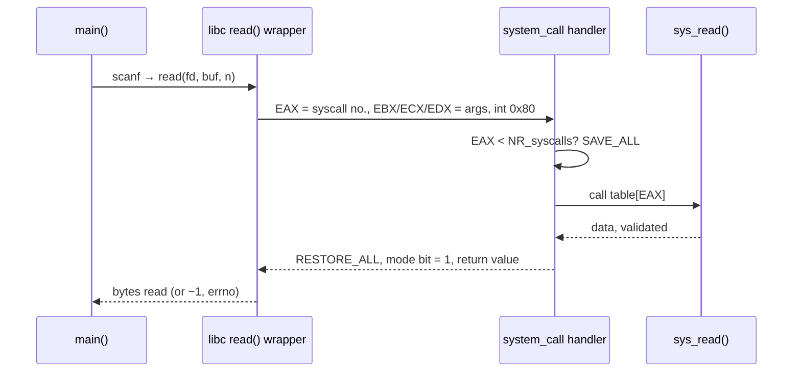
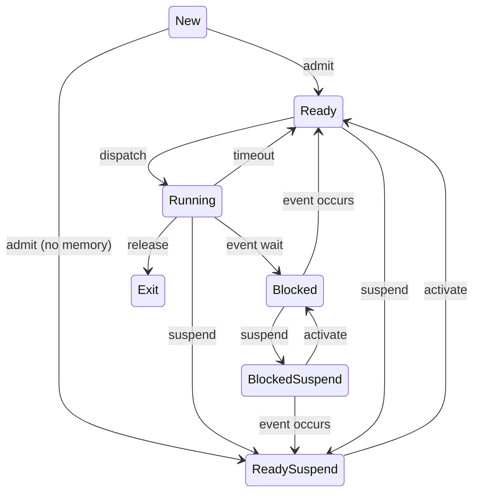
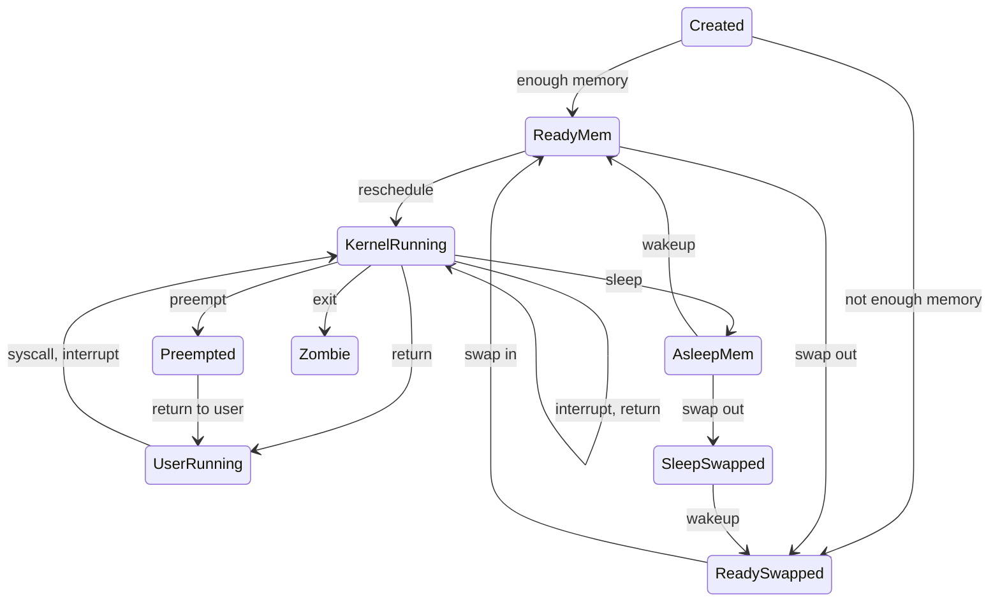
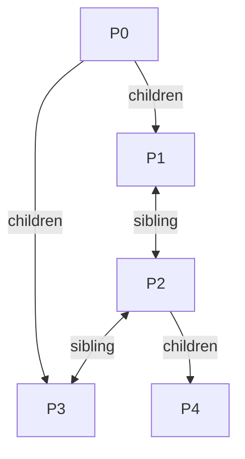

# CS G623 Advanced Operating Systems — Course Textbook

Sep 24, 2026 · @foidslayer

## How to use this book

This book rebuilds Prof. Biju's AOS lectures 1–18 as continuous reading, so you can study for the 08 Oct midsem (closed book, 25%) from one place. Where his lecture and the textbook disagree, the lecture version comes first, because he sets the paper.

**Sources, in order of authority**

| Source | What it gives you | Coverage |
| --- | --- | --- |
| Lecture transcripts (Whisper) | What he actually said, his examples, his "never say" lines | Lec 3–14, 16, 17 (Lec 1, 2, 15 missing) |
| His slides (Quanta) | The flow and the exact definitions he tests | L01–L18 (no L06) |
| Silberschatz 10e (T1) | Main text | Ch 1–7, 9–14, 17–18, 20 |
| Stallings 6e Ch 3–4, App. A | 7-state model, SVR4 diagram and process image, PCB categories, fork steps, thread:process table | His slides copy it word for word |
| ULK 3e (Bovet & Cesati) Ch 1–3, 7, 9, 10 | Linux task states, PIDs, do\_fork, O(1) priority formulas, the `int 0x80` path | Lec 4, 8–18 |
| Singhal & Shivaratri (T2) | Multiprocessor architecture (Ch 16); why distributed clocks are hard (§5.2) | Lec 3 |
| Senior's Notion notes (last year's class) | Threads and synchronization, which he taught before last year's midsem | Corroboration only; errors flagged inline |

**Reading conventions**

- **★ Exam** marks something he asked in class or that appeared on the 2025 midsem.
- **His answer** marks a point where his lecture differs from a textbook. Write his version.
- **Why** paragraphs matter more than the facts. He marks down answers that state a mechanism without the reason ("every selection must have a justified reason").
- **Interview link** notes a system-design or placement angle in one line.
- **Read:** under each section gives the book, section and **printed page numbers** of the copies in your AOS folder: Sil = Silberschatz 10e (`ASOC.pdf`), Stallings = 6e, ULK = *Understanding the Linux Kernel* 3e (`ulk3.pdf`), T2 = Singhal & Shivaratri (`Singhal_Shivaratri_OCR.pdf`), slides = his Quanta deck and slide number. Notion = the senior's notes of his class last year (`notion-page.pdf`, PDF page numbers), cited as corroboration only. "Lecture only" means no textbook covers the point; his slide or lecture is the source.

**Scope for the midsem.** The handout gives no separate midsem syllabus, so the paper covers whatever is taught by 08 Oct. As of 24 Sep the slides reach L18 (20 Sep): architecture, design paradigms, system calls, protection, memory protection and processes (states, PCB, fork/exec/wait, `do_fork`, `do_exit`). In Lec 16 he said threads come "in coming classes", and last year threads and synchronization were 15 of 75 midsem marks, so Chapters 9–10 cover them before he does. Left out because he has not taught them and last year's paper did not ask them: the O(1) active/expired arrays, CFS, Amdahl's law, the lab and ADT conventions (onlines, not the midsem) and the distributed-systems material (Module 3, after the midsem).

**His study rule (Lec 17):** three hours of self-study after each lecture. The slides only give the flow; the explanations below come from what he said in class.

## Chapter 1 — Kinds of systems and the hardware underneath (Lec 1–3)

An OS is defined by what it multiplexes and what hardware it runs on. This chapter sets up the vocabulary he uses for the rest of the course: how jobs share one CPU, what a modern core does, and how multiple cores share (or don't share) memory.

### 1.1 Batch, multiprogramming, multitasking, multi-user

**Read:** Sil §1.4.1, pp. 23–24; slides L01 p. 7, L02 p. 2 (the J1–J3 example).

- **Batch:** one job runs start to finish. The CPU sits idle during that job's I/O.
- **Multiprogramming:** several jobs are in memory. The OS switches **only when the running job blocks** (I/O, wait). Goal: keep the CPU busy.
- **Multitasking (time sharing):** multiprogramming plus a **timer**. The OS also switches when the time quantum expires. Goal: fast response for every job.
- **Multi-user:** a different axis. Many users are logged in at once; the OS isolates them so one misbehaving user cannot hurt another, and enforces per-user **soft and hard limits** (e.g. number of processes; ULK "Process Resource Limits", pp. 101–102). The hardware underneath is still multitasking.
- **The rest of his slide list** (L01 p. 7, L03 p. 2), one line each: *clustered* = separate machines joined by a network that share storage, for high availability (Sil §1.3.3, pp. 19–20); *distributed* = loosely coupled machines that share nothing and talk only by messages (Sil §1.8, p. 35); *cloud* = compute and storage rented as a service over the network (Sil §1.10.5, p. 44); *real-time / embedded* = fixed-purpose systems with hard timing deadlines (Sil §1.10.6, p. 45).

**His one-liner (Lec 3):** multitasking performs better for users; multiprogramming has fewer decision points (fewer scheduler invocations, less overhead).

**Worked example (L02 slide).** J1 = 8 CPU, 4 I/O, 3 CPU (arrives 0). J2 = 5 CPU, 5 I/O, 9 CPU (arrives 1). J3 = 2 CPU, 2 I/O, 6 CPU (arrives 2). One CPU, I/O devices can overlap, FCFS ready queue. Simulated below.

| Policy | CPU timeline (one char = 1 unit) | Finish J1 / J2 / J3 | Makespan | First response J2 / J3 |
| --- | --- | --- | --- | --- |
| Batch | J1 0–8, idle 8–12, J1 12–15, then J2, then J3 | 15 / 34 / 44 | 44 (CPU 75% busy) | 14 / 32 |
| Multiprogramming | `11111111 22222 33 111 333333 222222222` | 18 / 33 / 24 | 33 (100%) | 7 / 11 |
| Multitasking, RR q = 2 | `11 22 33 11 22 33 11 2 33 11 33 22 11 22 1 22222` | 28 / 33 / 21 | 33 (100%) | 1 / 2 |

Read it this way. Multiprogramming already removes the idle gaps (44 → 33). Multitasking keeps the same makespan but cuts the wait before a job first gets the CPU from 7–11 units to 1–2. The price is many more switches: 5 context switches after t = 0 versus 15.

★ **Exam (2025 Q1D):** "Show multitasking beats multiprogramming." Use an interactive example: an editor and a long compile. Under multiprogramming the compile holds the CPU until it blocks, so keystrokes lag. Under multitasking the timer hands the editor the CPU within one quantum.

### 1.2 Inside one core

**Read:** Notion pp. 1–3 (von Neumann, Harvard, modified Harvard, i3/i5/i7/i9, turbo boost vs overclocking). Hardware threads: Sil §5.5.2, pp. 221–223 (chip multithreading, Fig 5.14). Von Neumann is named only in passing in Sil §1.5.2, p. 28. Pipelining, superscalar and out-of-order execution are lecture only (Lec 3; slides L03 p. 2); no course text covers them.

- **Pipelining** is instruction-level parallelism: IF, ID, EX, MEM, WB overlap. The clock period equals the **slowest stage**. A deeper pipeline allows a faster clock but adds latch overhead and costs more on a flush.
- **Superscalar:** some stages are replicated, so more than one instruction issues per cycle.
- **Out-of-order execution:** instructions execute out of order but **retire in order**; a buffer (he called it the reservation station) holds early results.
- **Hyper-threading:** 2 **hardware** threads per core (two register sets sharing one pipeline). Never confuse these with software threads.
- **Turbo boost** is dynamic voltage and frequency scaling. Power ∝ V²f, so running slower at lower voltage saves energy; turbo raises frequency within the chip's rated maximum. Overclocking goes beyond that maximum, manually.

**His answer on i3/i5/i7/i9:** i3 = hyper-threading; i5 = turbo boost; i7 = hyper-threading + turbo; i9 = hyper-threading + multiple turbo levels. "**Never say the difference is frequency.**" This is his framing, not Intel's product definition, so give it only in his exam.

**Von Neumann vs Harvard** (★ 2025 Q1B). Von Neumann has one memory and one bus for code and data, so fetch and data access cannot happen in the same cycle; code is just data. Harvard has separate memories for code and data. **Modified Harvard** (what every modern CPU is) keeps one main memory but **splits L1 into I-cache and D-cache**, so fetch and load/store proceed in parallel.

### 1.3 Many cores: symmetric, asymmetric, heterogeneous

**Read:** Sil §1.3.2, pp. 16–18 (SMP, Fig 1.8 p. 17); Sil §5.5.1, p. 220 (asymmetric multiprocessing); Sil §5.5.5, p. 226 (big.LITTLE); slides L01 p. 7.

"Symmetric" depends on what you compare (★ he asked: cores at 3.2/4.2/3.2/3.6 GHz with the same ISA, symmetric or not?).

| Case | ISA | Frequency | Can a process migrate? | Example |
| --- | --- | --- | --- | --- |
| Truly symmetric (SMP) | Same | Same | Yes | What SMP Linux assumes |
| Symmetric by ISA, asymmetric by speed | Same | Different | Yes | big.LITTLE, Intel P/E cores (Sil §5.5.5, p. 226) |
| Heterogeneous multicore | Different | Any | **No** — share data through memory only | CPU + DSP/GPU |

Fast and slow cores exist to save energy: run light work on slow cores and power the fast ones down.

**Textbook sense of "asymmetric" (Sil §5.5.1, p. 220):** one master core runs all kernel code and scheduling; the others run only user code. Silberschatz notes that big.LITTLE is *not* asymmetric in this sense, because every core runs both kernel and user code (p. 226). Say which meaning you are using.

### 1.4 The cache hierarchy and coherence

**Read:** Sil §1.5.5, pp. 30–32 (coherency, p. 32); T2 §16.5, pp. 440–441.

- **L1 is always private and always split (I/D)**, because it is part of the pipeline: IF and MEM access it in the same cycle (★ "why is L1 always split?").
- **L2** is private or shared, always unified.
- **L3** is always shared, dynamically partitioned between cores.

**Coherence.** Each core may hold a copy of the same line. When one core writes, the others must be told.

- **Write-invalidate** (preferred): one broadcast invalidates the other copies. The writer's line becomes Exclusive/Modified, and further writes need no bus traffic.
- **Write-update:** every write is broadcast to all copies and the writer waits for n−1 acknowledgements. It wins only when two cores ping-pong on the same data.

**Lookup order on an L1 miss (★ 2025 Q1C):** own L1 → **other cores' L1** → L2 → L3 → memory. Why check a peer's L1 before your own L2? Correctness, not speed: under write-back the peer may hold the only up-to-date (Modified) copy, and L2/memory are stale. The marker gave 0 for "main memory"; the answer is "the next cache level, or a peer's L1 if it holds the line modified".

**Write batching:** a 1-byte write dirties a cache line; lines are written back as blocks; blocks go to disk as 4 KB pages. Accumulate writes; never push single bytes down the hierarchy.

### 1.5 Tightly vs loosely coupled; UMA, NUMA, NORMA

**Read:** T2 §16.3, pp. 436–437 (UMA/NUMA/NORMA, p. 437); Sil §1.3.2, pp. 18–19 (NUMA, Fig 1.10 p. 19); Sil §1.8, p. 35; T2 §5.2, pp. 97–99 (no global clock); Sil §3.8.2, pp. 149–152 (RPC).

|  | Tightly coupled | Loosely coupled (distributed) |
| --- | --- | --- |
| Memory | Shared | Nothing shared |
| Communication | Loads and stores | **Message passing only** |
| Clock | One | One per node |
| Synchronization | Easy | Very hard |
| Scale | One box, or a rack over InfiniBand | Anything on a network |

**Memory models.** Textbook (Sil §1.3.2, pp. 18–19; T2 §16.3, p. 437): **UMA** = every CPU sees the same memory access time; **NUMA** = each CPU has local memory that is faster than remote memory; **NORMA** = no remote memory access at all, only messages.

**His answer:** all tightly coupled multicores are NUMA, because your own L1 is faster than a peer's L1, which is faster than L3, and so on. "UMA is not practical and is never used." **NORMA** belongs to loosely coupled systems: you ask the remote *processor*, which validates the request and sends the data. It is slower but safer than shared memory. Lead with his version, then give the textbook definition in one line.

**Why distributed synchronization is hard (★):** you cannot measure message delay. Routes change, hop counts differ, queues fill and drain, so two clocks can never be set exactly equal ("1000+ algorithms"). This is the motivation for logical clocks after the midsem (T2 §5.2, pp. 97–99).

**RPC:** a remote procedure call blocks the caller until the remote side replies. The blocking is caused remotely, not by a local resource.

**Interview link:** "why do caches need coherence, why invalidate over update" and "what makes clock sync hard" are standard systems-interview openers.


## Chapter 2 — How an OS is built: design paradigms (Lec 4–5)

Every kernel trades performance against modularity. Layered and microkernel designs buy clean structure and pay in overhead; monolithic kernels buy speed and pay in rebuilds. Real systems mix them.

### 2.1 Layered approach

**Read:** Sil §2.8.2, pp. 83–84; slides L04 pp. 3–4.

The OS is split into layers: layer 0 is the hardware, layer N is the user interface, and each layer uses **only** the services of the layer directly below (the OSI analogy).

- **Pros:** easy to debug and verify layer by layer.
- **Cons:** layers must be defined carefully (who goes below whom?), and every request pays every layer's overhead, even layers you don't need, because you cannot bypass them.
- **Modular ≠ layered.** One layer can contain many modules; modules can talk to any other module through defined interfaces, not only to the one below.

### 2.2 UNIX and Linux structure

**Read:** Sil §2.8.1, pp. 82–83 (UNIX and Linux structure figures); Sil §20.2, pp. 780–783; ULK Ch 10, pp. 399–404 (single entry point, `int $0x80`); slides L04 pp. 5–7. Inlining is lecture only (Lec 4); no course text covers it.

User program → C library wrapper (e.g. `scanf` in `libc.so`) → **system-call interface** → kernel (process control including IPC and scheduling, memory management, file system, device drivers) → hardware. The kernel **validates** all data coming from devices before handing it to a user.

- **Single entry point:** every system call enters the kernel at the same place (`int 0x80` on x86-32). The call number goes in EAX and the kernel dispatches through a table (Chapter 3).
- **Monolithic:** the whole kernel is one image (`bzImage`). Adding a syscall means recompiling and rebooting.
- **Linux = monolithic with modular design:** loadable kernel modules (`insmod`) add drivers and file systems at runtime.
- **Why kernel helpers are `inline` (★):** a call flushes the prefetch queue and pipeline and may miss in the I-cache. Inlining keeps the source modular but removes the call at compile time. Recursion is avoided in the kernel; gcc can turn tail recursion into a loop.

### 2.3 "Everything is a file or a process"

**Read:** ULK Ch 1, pp. 14–19 (hard and soft links, file types, inodes, file-handling calls); Sil §13.1.2, pp. 532–536 (per-process and system-wide open-file tables, open count); Sil §13.3.3, pp. 545–547 (absolute vs relative paths); Sil §14.2, pp. 566–568 (in-memory structures, `open()`); Sil §14.4.3, pp. 575–577 (UNIX inode, Fig 14.8 p. 577); Sil §12.3.1, pp. 503–504 (block vs character devices); Sil §14.6, pp. 582–586 (buffer cache).

`stdin`, `stdout` and `stderr` are files. `ls -l` type letters: `-` regular, `d` directory, `c` character device, `b` block device, `l` link. **Only hard links and symbolic links exist** — his words: "there is nothing called a soft link." A symlink to a deleted file dangles.

- A **PID is an index** into an array of fixed-size process descriptors. "PID 200" means slot 200.
- An **inode** is the UNIX file control block (`ls -i`). A process remembers only two inodes: **root** (system-wide) and **cwd** (per process).

**★ Disk accesses to open a path** (nothing cached, each directory fits in one block). `fopen("/bin/a1.txt","r")`:

1. inode of `/`
2. data block of `/` (find `bin`)
3. inode of `bin`
4. data block of `bin` (find `a1.txt`)
5. inode of `a1.txt`
6. first data block of `a1.txt`

```latex
\text{accesses} = 2 \times (\text{directories on the path, including } /) + 2
```

A 4-level path such as `/a/b/c/d.txt` costs 2 × 4 + 2 = 10 (Lec 13). Starting from the cwd skips the upper levels, which is why applications keep their files under one directory. Mode `"a"` loads the **last** block instead of the first; `"w"` truncates to size 0.

**File tables (★, returns in Chapter 7).**

| Table | Scope | Holds |
| --- | --- | --- |
| File descriptor table | Per process | fd 0/1/2 = stdin/stdout/stderr (hence `2>` redirects only stderr); pointer to the system entry; **the offset is per process** |
| Open-file table | System-wide | One entry per open file; **open count** |
| Inode table | System-wide | In-memory copies of inodes |

`fclose` only decrements the open count; the last close writes back and frees the entry. Process exit closes everything automatically.

**Buffer cache:** only for **block** devices, never character devices. It lives in main memory (not the CPU cache) and exploits spatial and temporal locality. Byte-granular transfer happens only between CPU and L1; every other level moves whole blocks.

**Inode pointers (Lec 17, "make the common case fast").** He uses **10 direct** pointers (Silberschatz Fig 14.8, p. 577, draws 12 — use 10 in his exam) plus single, double and triple indirect. With 4 KB blocks and 4-byte pointers, one block holds 1024 pointers:

| Pointer | Reach |
| --- | --- |
| 10 direct | 10 × 4 KB = 40 KB |
| Single indirect | 1024 × 4 KB = 4 MB |
| Double indirect | 1024² × 4 KB = 4 GB |
| Triple indirect | 1024³ × 4 KB = 4 TB |

Most files are small, so most accesses need only the direct pointers (the 80/20 rule).

**Scope note (his words):** file-system internals belong to Data Storage Technologies. AOS covers scheduling, IPC and part of memory management; the open/offset/open-count reasoning is what he examines.

### 2.4 Microkernel

**Read:** Sil §2.8.3, pp. 84–85; Stallings §4.3, pp. 179–185; slides L05 pp. 3–5; Notion p. 4.

Move everything possible out of the kernel into user-space servers. The kernel keeps only the essentials, and its **main job is message passing (IPC)** between those servers.

| Benefits | Detriment |
| --- | --- |
| Easy to extend: add services without recompiling or rebooting | **Performance:** every request crosses user ↔ kernel as messages, with copies and context switches |
| **Easy to port:** only the small core is architecture-specific (time-to-market for ASICs, embedded) |  |
| More reliable and secure: less code runs in kernel mode |  |

★ **Exam (2025 Q7A):** "A microkernel has higher overhead than a layered kernel" — **TRUE.** Microkernel services live in separate address spaces and talk by messages; a layered kernel is one address space with function calls between layers. The student who wrote False got 0.

**Choose by application (Lec 5):** for a high-performance system he would never recommend a microkernel; for an embedded system he would never recommend a monolithic kernel.

**History (L05):** early 90s microkernels were "the king"; late 90s too slow, but modularity was borrowed by other designs; 2000s onward, hypervisors use microkernel ideas. Examples: **QNX** (automotive, avionics; he recommends its certification), TinyOS on sensor motes, Mach 3.0, OKL4. Nano- and pico-kernels are smaller still, for devices like a pacemaker that must run 4+ years on one battery.

### 2.5 Modules and hybrids

**Read:** Sil §2.8.4, p. 86; Sil §2.8.5, pp. 86–91; Sil §20.3, pp. 783–786; slides L05 pp. 6–8; Notion pp. 4–5.

Modern kernels use **loadable modules**: object-oriented, each core component separate, talking over known interfaces, loaded on demand. It is like layering but more flexible.

**"No OS follows a single paradigm."**

| System | Mix |
| --- | --- |
| Linux, Solaris | Monolithic in kernel space + modules for dynamic loading |
| Windows NT/7/8/10 | Mostly monolithic + microkernel-style subsystem "personalities" |
| macOS | Hybrid, layered (Mach + BSD, Aqua UI, Cocoa) |
| KVM, Xen | Hypervisors with microkernel traits |
| Pure monolithic | BSD, System V, MS-DOS, Windows 9x |

**Portability:** Linux keeps architecture-specific code under `arch/`; gcc cross-compiles for other targets.

**Load on demand.** Modular design lets code be loaded only when used: pages start invalid and fault in. 20% of the code runs 80% of the time.


## Chapter 3 — Protection and the system call (Lec 7–10)

A user program can never touch the hardware directly; it asks the kernel through a system call, and the kernel checks everything before acting. This chapter is his most-repeated topic (★ midsem priority #1): the protection trio, the syscall path register by register, and why a syscall is expensive.

### 3.1 Why protection, and the three kinds

**Read:** Sil §1.4.2, pp. 24–25 (dual and multimode); Sil §9.1.1, pp. 350–352 (base and limit); Sil §1.7, p. 34 and §18.5.3–18.5.5, pp. 714–717 (hypervisor types, paravirtualization); Sil §17.3, pp. 669–671 (protection rings); slides L07 pp. 3–4, L08 pp. 2–4; Notion pp. 6–7.

- Single-task system: protect the **OS** from an incorrect program.
- Multiprogramming/multitasking: protect the OS **and other programs**. A process may harm only itself; overwriting your own memory is your problem, touching someone else's is a segmentation fault.

| Resource | Mechanism | Detail |
| --- | --- | --- |
| I/O | **Privileged instructions** | All I/O instructions run only in kernel mode; the OS performs I/O and validates the data |
| Memory | **Base + limit registers** (then segmentation/paging, Chapter 4) | Legal range is base … base + limit − 1; also protects the interrupt vector and ISRs |
| CPU | **Timer** | The only way the OS regains control from a looping process |

**Dual mode.** A hardware **mode bit: 0 = monitor/kernel/supervisor, 1 = user.** Lower number = more privilege throughout Linux. The CPU switches to kernel mode on an interrupt or fault, on an attempt to run a privileged instruction, and on a system call; the return from the call resets it to user. Modern CPUs are **multi-mode**: an extra mode for the virtual machine manager (VMM) so guest kernels can run.

**Virtualization (Lec 7).** *Hosted* (type 2): the guest OS runs on a host OS — slower. *Hypervisor* (type 1): every OS runs directly on the VMM. Para-virtualization modifies the guest; full virtualization does not. VMware's translation layer is written in assembly.

### 3.2 The timer: the only CPU protection (★)

**Read:** Sil §1.4.3, p. 26 (the counter is decremented on every clock tick and interrupts at 0, i.e. a down-counter); slides L07 p. 5; Notion p. 8. The NOR-gate reason for counting down is lecture only (Lec 7).

A pure multiprogramming system cannot stop `while(1);`, because the OS runs only when the job blocks. The timer fixes that:

1. The OS loads a counter (a **privileged** instruction).
2. The physical clock decrements it.
3. At zero it raises an interrupt, and control returns to the kernel, which can reschedule or kill the job.

Even if only one job exists, the timer still returns control to the OS. Timers are **down-counters** because detecting zero needs a single NOR gate, while comparing against a target needs a row of XORs. The timer also implements time sharing and keeps the current time.

### 3.3 The system-call path

**Read:** Sil §2.3.2, pp. 63–66 (parameter passing, Fig 2.7 p. 66); ULK Ch 10, pp. 399–404 (handler, `int $0x80`) and pp. 409–412 (parameter passing, verifying parameters); slides L09 pp. 2–10, L10 pp. 2–3, 7.



One `scanf` = several function calls + one user→kernel mode switch + one return. The kernel side, step by step:

1. `int 0x80` traps to the **single entry point**; the mode bit becomes 0.
2. **Check EAX < NR\_syscalls** (last number + 1). EAX equal to that value is invalid.
3. **SAVE\_ALL** pushes every register onto the kernel stack.
4. Jump through the **system-call table** at **base + EAX × 4** (32-bit) or **× 8** (64-bit). His example: table at 2000, EAX = 4 → entry at 2016, which holds the address of the handler.
5. Run the handler (`sys_read`), which may block on I/O.
6. Validate the result; **RESTORE\_ALL**; set the mode bit to 1; return to **PC + 4** (the instruction after the call).

**Parameter passing (★, Sil Fig 2.7).**

| Method | How | Notes |
| --- | --- | --- |
| Registers | **EAX = call number; up to 5 args in EBX, ECX, EDX, ESI, EDI** | Fastest |
| Block in memory | Args in a table; its **address** goes in one register | Linux and Solaris use this when there are more than 5 args (e.g. `ioctl`) |
| Stack | Program pushes, OS pops | Slowest (push + pop); like block, no limit on count |

★ **"Why is memory slower than registers for parameters?"** Not only the extra memory access: every pointer from user space must be **validated** before the kernel follows it.

**Pointer verification (L10, three checks).** Before following a user pointer, the kernel ensures it points (1) into **user space** (the kernel can address everything, so it must protect itself first), (2) into **this process's** address space, and (3) at memory that is **readable** for a read and **writable** for a write. Many "arguments" are really output addresses (`scanf`, `ioctl`), so check (3) matters.

### 3.4 Mode switch vs context switch

**Read:** Stallings §3.4, pp. 138–140 ("Mode Switching", "Change of Process State"); Stallings §3.5, pp. 140–143 (execution of the OS); Sil §3.2.3, pp. 114–115.

|  | Mode switch | Context (process) switch |
| --- | --- | --- |
| What changes | Privilege level only | The running process |
| Saved | Registers onto the kernel stack | Full processor state into the PCB; memory-management state switched |
| Cost | Cheaper | Much costlier (TLB flush, cold caches) |

In UNIX the kernel runs **in the context of the user process** (Stallings §3.5, pp. 140–141), so a syscall is only a mode switch. If the kernel were a separate process, every mode switch would also be a context switch.

### 3.5 Why syscalls are expensive

**Read:** slides L10 p. 6 ("each arrow is a jump"); Notion p. 4. Losing the CPU on the way back from a syscall: Stallings §3.7, p. 149 (in SVR4, preemption happens only when a process is about to return from kernel to user mode) and ULK Ch 7 "Process Preemption", pp. 260–261 (`TIF_NEED_RESCHED` is set when a higher-priority task becomes runnable, and the scheduler runs on the way out of the kernel). "Pending queue" is his name for this.

- Every arrow in the syscall path is a jump; each jump may **flush the prefetch queue and pipeline** and cause a **cache miss** (L10). Prefetching is wasted whenever you jump somewhere else (his movie-frame analogy).
- SAVE\_ALL / RESTORE\_ALL move every register.
- **You can lose the CPU.** Newly ready processes wait in a pending queue and are admitted when the kernel is about to return to user mode.

**Worked example (Lec 7).** P1 has a 200-cycle quantum. Higher-priority P2 becomes ready at t = 50. P1 makes a syscall at t = 100. On the way back from the kernel, P2 is admitted and **P2 runs**; P1 goes back to the ready queue. Without the syscall, P1 would have kept the CPU until its quantum expired at t = 200. Lec 10 repeats it with priorities: you are at 110, a 108 is admitted while you are in the kernel, and the 108 runs next.

★ **Exam (2025 Q6E):** "A system call can move the running process to Ready" — **TRUE**, for exactly this reason (e.g. `sem_post` or `kill` wakes a higher-priority task, `TIF_NEED_RESCHED` is set, and the caller is preempted on return).

**Practical rule:** avoid unnecessary syscalls; batch work into fewer calls. Calling by number via `syscall()` skips one wrapper.

### 3.6 Reads, writes and the disk

**Read:** Sil §11.1.1, pp. 450–452 (seek and rotation); Sil §12.4.2–12.4.3, pp. 509–511 (buffering, caching); Sil §14.6.2, pp. 583–586 (synchronous vs asynchronous writes, p. 585).

A **write** is acknowledged as soon as the data reaches the disk controller's cache; the platter write happens later, often piggybacked on a nearby read so seek and rotation are already paid. A **read** blocks until the data is in RAM. So writes *feel* faster. This is why a file can be empty after a crash (the data was still buffered) and why `fsync` exists.

### 3.7 Designing a system call (L10)

**Read:** slides L10 pp. 5, 7–12; Sil §2.3.3, pp. 66–73 (types of system calls; Windows vs UNIX table, p. 68); ULK Ch 10, pp. 398–399 (POSIX API vs system call).

- **One purpose** per call; compose several calls rather than building one CISC-style call.
- Define arguments, return value and **error codes**.
- Portable and robust.
- **Verify every pointer** (the three checks above).
- **Never invoke a syscall from inside the kernel.** Call the kernel function directly.
- **No floating point in the kernel.** Assignment trick: pass the IEEE-754 bits as an unsigned int and decode sign/exponent/mantissa in the kernel; return distinct error codes for NaN, ±∞, overflow, underflow.

| Pros | Cons |
| --- | --- |
| Simple to implement, easy to use | Needs an officially assigned number |
| Very fast in Linux | Once stable, the interface can never change (stable ABI; deprecated numbers are never reused) |
|  | Each architecture registers it separately |
|  | Overkill for simple information exchange |

**Syscall vs function call (★):** a syscall involves at least a user→kernel mode switch, takes much longer, and **always returns a value** (`long`; −1 on error, then `perror("msg")`). A subroutine need not return anything.

**Where a syscall lives in the 5.19 source:** table entry in `arch/x86/entry/syscalls/syscall_64.tbl` (ABI `common`/`64`/`x32`; don't reuse reserved numbers 387–423; add after the last); prototype in `include/linux/syscalls.h`; definition with `SYSCALL_DEFINEn(name, ...)`; fallback `sys_ni_syscall` in `kernel/sys_ni.c` for unimplemented numbers. `vfork` is deprecated but still there: syscalls are never removed.

**Catalogue (L10).**

| Class | Calls |
| --- | --- |
| Process control | `fork, wait, waitpid, execl, execlp, execv, execvp, exit, signal, kill, alarm, pause, getpid, getppid, nice` |
| File management | `creat, open, close, unlink, read, write, lseek` (the offset is per process, never passed; `lseek` moves it) |
| IPC: pipes | `popen, pclose, pipe, dup, mkfifo, mknod` |
| IPC: message queues | `msgctl, msgget, msgsnd, msgrcv` |
| IPC: shared memory | `shmat, shmctl, shmdt, shmget` |
| Memory | `malloc` → `brk`/`sbrk` (a library call on top of a syscall) |

`man 2 read` = the system call; `man 3 read` = a library routine (e.g. `man 2 exit` vs `man 3 exit`).

**Windows equivalents** (slide L10 p. 11, Sil p. 68): `CreateProcess()` ↔ `fork()`, `ExitProcess()` ↔ `exit()`, `WaitForSingleObject()` ↔ `wait()`, `ReadFile()`/`WriteFile()` ↔ `read()`/`write()`, `CreatePipe()` ↔ `pipe()`, `CreateFileMapping()`/`MapViewOfFile()` ↔ `shm_open()`/`mmap()`.

**Other hardware from Lec 7 (short answers):** DMA moves disk→RAM without the CPU and interrupts when done. SDRAM is clocked by the external bus, so the CPU knows when to check back. SRAM (caches) needs no refresh; DRAM does. Execution time = `utime + stime`.

**Interview link:** "what happens when you call `read()`" and "why are syscalls slow / how does io\_uring or vDSO help" are classic systems-interview questions; this section is the whole answer.


## Chapter 4 — Memory protection, the TLB and the real cost of a switch (Lec 5, 8, 9, 11)

Memory protection moved from one base/limit pair to segmentation and paging; Intel uses both. The TLB makes paging fast, and flushing it is the hidden cost of every context switch. He uses this material to ask "where is X stored" and counting questions.

### 4.1 Contiguous allocation

**Read:** Sil §9.1.1, pp. 350–352; Sil §9.2.1, pp. 357–358; slides L08 p. 2.

One **base** register (smallest legal address) and one **limit** register (size of the range). Every user-mode address is checked: legal if base ≤ addr < base + limit; otherwise the hardware traps to the OS. Loading base/limit is privileged.

### 4.2 Segmentation: the user's view

**Read:** Sil §9.6.1, pp. 379–380 (IA-32 segmentation; selector layout, p. 380); Sil §9.2.3, pp. 359–360 (50-percent rule, p. 359); ULK Ch 2, pp. 36–45 (segmentation in hardware and in Linux, GDT/LDT). Silberschatz 10e has no standalone segmentation section.

A program is a set of segments: code, data, stack, extra. An address is (segment, offset).

- **Segment-table entry = base + limit (length).**
- Check **offset < limit** (strictly less; equal is already out of range). Pass → physical address = base + offset. Fail → segmentation fault.
- **Intel IA-32:** two descriptor tables, **LDT** (per process) and **GDT** (global), **8K entries each**. A selector is 16 bits = **13-bit index + 1 table-indicator bit (LDT/GDT) + 2 protection bits**. So at most **16K segments** per process, never more than 8K of either kind.
- **External fragmentation.** Variable-size segments leave holes. The **50-percent rule** (Sil §9.2.3, p. 359): with N blocks allocated, about 0.5N are lost to fragmentation, so **one-third of memory may be unusable**.

### 4.3 Paging: the machine's view

**Read:** Sil §9.3.1, pp. 360–365; Sil §9.3.3, pp. 368–369 (valid–invalid bit); Sil §9.6.1, pp. 379–382 (segmentation + paging on IA-32). "Only the TLB stores the page number" and the no-limit-register argument are lecture only (Lec 8).

Memory is split into fixed-size frames; the logical address is (page number, offset). The offset passes through untranslated.

- **Page-table entry = frame number + valid/invalid bit + auxiliary bits** (protection, dirty, referenced).
- ★ **"Where is the page number stored?"** Nowhere in the page table — it is the **index**. The **only place a page number is stored is the TLB**, which is fully associative and must match on it.
- ★ **"Why does paging need no limit register?"** Every page is the same size, so an offset can never exceed it. (His networking analogy: fixed-size cells need no length field.)
- Paging has no external fragmentation, only internal (the last page is partly empty).

**Intel = segmentation + paging.** The user sees segments; memory stores pages; translation is two lookups (segment → linear address → page → physical).

| Question he asks | Segment-table entry | Page-table entry |
| --- | --- | --- |
| Contents | Base, limit, protection | Frame number, valid bit, protection/dirty/referenced |
| Needs a bounds check? | Yes: offset < limit | No: fixed size |
| Fragmentation | External | Internal |

### 4.4 Address binding and swapping

**Read:** Sil §9.1.2, pp. 352–353; Sil §9.5, pp. 376–379; Sil §11.5.1, pp. 463–465 (raw disk, p. 464); Sil §11.6, pp. 467–469 (swap on a raw partition, p. 468). Sizing: Sil §11.6.1, p. 468 (Linux historically suggested swap = 2× physical memory; modern systems use less). The PCB stays in memory: Sil §9.5.1, p. 377 (the OS keeps metadata for swapped-out processes in memory) and Stallings p. 150 (process table entries are always in main memory).

| Binding time | Addresses | Where a swapped process can come back |
| --- | --- | --- |
| Compile time | Absolute, fixed in the code | Same place only |
| Load time | Relocated once at load (e.g. CS:IP with a base) | Same place only |
| **Execution time** | Translated on every access by page/segment tables | **Anywhere** |

Modern systems use execution-time binding. **Swap space is a raw partition** (no file system), sized 1.5–2× RAM: a raw byte dump is faster than going through a file system, and endianness does not matter because the same machine reads it back. **The PCB is never swapped**; only code, data, heap and stack go to swap.

### 4.5 Context switch: constant time, varying impact (★)

**Read:** Sil §3.2.3, pp. 114–115; Sil §9.3.2, pp. 365–368 (TLB, ASIDs p. 366); slides L18 p. 20.

**"Context-switch *time* is constant; context-switch *impact* varies."**

- **Time is constant:** SAVE\_ALL saves every register to the PCB whether it was used or not, and restores every register of the next process. The register count is fixed per architecture.
- **Impact varies:** the **TLB is flushed**, and the next process may evict your cache lines. How much you lose depends on who ran in between.

**Why flush the TLB?** Page numbers overlap across processes (every process has a page 0), so a stale entry would map to another process's frame. **ASID/PID-tagged TLBs** avoid the flush; entries then need flushing only when the process terminates.

**TLB vs L1.** The TLB (20–32 entries) is faster than L1. Caches are indexed by **physical** address, so the TLB lookup comes **before** L1.

### 4.6 TLB miss vs cache miss

**Read:** Sil §9.3.2, pp. 365–368 (hit ratio and effective access time, p. 367); ULK Ch 2, p. 57 (TLBs). The 1100-access count is lecture only (Lec 9).

|  | TLB miss | Cache miss |
| --- | --- | --- |
| Handling | **Exception** → OS walks the page table, fills the TLB, **re-executes the instruction** | Hardware stall (memory stall cycles) |
| Mode switch? | Yes | No |

**His answer on counting (★):** 1000 memory accesses with 100 TLB misses = **1100 TLB accesses**, because each missed instruction re-executes and hits the second time. "Textbooks get this calculation wrong." This is the software-managed TLB model (MIPS); x86 walks in hardware. Silberschatz's formula, for comparison (hit ratio h, one-level table):

```latex
\text{EAT} = h\,(t_{TLB} + t_{mem}) + (1 - h)\,(t_{TLB} + 2\,t_{mem})
```

If he asks "how many TLB accesses", count the retries. If he asks for effective access time, use the formula and say which model you assume.

### 4.7 Page faults: placement vs replacement

**Read:** Sil §10.2.1, pp. 393–396 (page-fault steps); Sil §10.4.1, pp. 401–404 ("if there is no free frame", p. 402).

On a page fault, "page **tables** are updated" — plural.

- **Placement:** a free (invalid) frame exists. Load the page there and update **only your** page table.
- **Replacement:** every frame is in use. Pick a victim, invalidate its entry in **its owner's** page table (write it back if dirty), load your page, validate your entry.
- Replacement happens **only when placement is impossible**.

### 4.8 Thrashing (Lec 5, 11)

**Read:** Sil §10.6, pp. 419–425 (cause pp. 419–420; working set pp. 422–424; page-fault frequency pp. 424–425); ULK Ch 9, pp. 395–398 (managing the heap, `brk`).

Plot CPU utilization against the degree of multiprogramming. Utilization rises, peaks, then collapses. Past the peak each process holds too few frames, so everyone page-faults and waits on the swap device. Utilization falls, and the **long-term scheduler reads the low utilization as "too few jobs" and admits more**, which makes it worse — hence the steep drop (Sil §10.6.1, pp. 419–420).

- **Detect:** process count rising while utilization falls; page-fault frequency above an upper bound; working-set size exceeding available frames.
- **Respond:** **first stop the long-term scheduler**, then suspend processes (medium-term scheduler, Chapter 5).

**Heap and `malloc`.** `malloc` is a library call on top of the `brk`/`sbrk` system call. `realloc` to a larger size may move the block (copy + free). Mobile systems often use one large heap.


## Chapter 5 — The process and its states (Lec 5, 11, 12)

A process is a program in execution plus everything the OS tracks about it. He teaches the state models as a ladder — 5 → 6 → 7 → UNIX SVR4 → Linux — and examines which transitions exist and **why** (★ midsem priority #2).

### 5.1 Program vs process

**Read:** Sil §3.1.1, pp. 106–108 (Fig 3.1 p. 106; "Memory Layout of a C Program" sidebar, p. 108); Stallings §3.7, pp. 149–150 (Table 3.10, UNIX process image); slides L11 pp. 2–7, 12.

A **program is passive** (code on disk); a **process is active**: code plus data, heap, stack, open files (descriptors), IPC and memory primitives, and an execution snapshot (PC and registers). In Linux even a thread is a process (a *task*).

**Process image, low to high address (slides L11 pp. 5–6; Sil Fig 3.1, p. 106, and the p. 108 sidebar):**

| Region | Holds | Notes |
| --- | --- | --- |
| Text | Code | Read-only, shared between parent and child |
| **.data** | **Initialized** globals and statics | e.g. `int z = 5;` |
| **.bss** | **Uninitialized** globals and statics | Zero-filled at load |
| Heap | `malloc` memory | Grows up via `brk` |
| Memory-mapped region | Shared libraries, `mmap` | Between heap and stack |
| Stack | Locals, arguments, return addresses | Grows down |
| Top | `argc`, `argv`, environment |  |

★ **Exam (2025 Q1A):** "Which variables are in .bss?" Only the **uninitialized globals/statics**. `int z = 5;` at file scope is .data; every local (and `argc`, `argv`) is on the stack. **Silberschatz's "Memory Layout of a C Program" sidebar (p. 108) swaps .data and .bss — an erratum.** Use the definition above.

`int *values` declared in a function lives on the stack and points into the heap. Code and data are kept in separate segments to match the split L1 I-cache/D-cache.

**Linux run-time image (slide L11 p. 7, 32-bit):** unused below `0x08048000`; read-only segment (`.init`, `.text`, `.rodata`) and read/write segment (`.data`, `.bss`) loaded from the executable; heap up to `brk`; shared-library mmap region from `0x40000000`; user stack below `0xc0000000`; kernel virtual memory above `0xc0000000`, invisible to user code.

**UNIX process image (slide L11 p. 12; Stallings Table 3.10, p. 149).** Three parts:

| Context | Contents |
| --- | --- |
| **User-level** | Process text, process data, user stack, shared memory |
| **Register** | Program counter, processor status register, stack pointer (kernel or user stack, depending on mode), general-purpose registers |
| **System-level** | Process table entry (always accessible to the OS), **U (user) area** (control information needed only while the process runs), per-process region table (virtual-to-physical mapping plus read/write/execute permissions), kernel stack |

The process table entry and the U area together are what the rest of this book calls the PCB. Why split it: the **process table entry is always in main memory**, because the kernel needs every process's entry at all times (e.g. to pick the next one to run); the **U area** is needed only while the kernel runs in *this* process's context (Stallings p. 150). His "the PCB is never swapped" (§4.4) is about the process table entry, i.e. Linux's `task_struct`.

### 5.2 The three schedulers

**Read:** Sil §3.2.2, p. 113 (medium-term scheduling sidebar); Stallings §3.2, pp. 121–126 ("Suspended Processes").

| Scheduler | Transition | Effect on degree of multiprogramming | Frequency |
| --- | --- | --- | --- |
| Long-term (admission) | New → Ready | **Increases** | Rare |
| Short-term (dispatcher) | Ready → Running | Neutral | Every few ms — the hottest code path |
| Medium-term (swapper) | Ready ↔ Ready/Suspend, Blocked ↔ Blocked/Suspend | **Decreases** | Under memory pressure |

### 5.3 Five states

**Read:** Stallings §3.2, pp. 117–121 ("A Five-State Model"); Sil §3.1.2, pp. 107–109 (Fig 3.2, p. 109); slides L11 p. 8.

New → Ready (admit, **no way back**) → Running (dispatch) → Exit. Running → Ready on timeout; Running → Blocked on an event wait; Blocked → Ready when the event occurs. **Blocked never goes directly to Running** — it must be dispatched again. A terminated process stays around until its parent reaps it.

### 5.4 Adding suspension: six and seven states

**Read:** Stallings §3.2, pp. 121–126 (Fig 3.9, p. 123); slides L11 pp. 9–10. Silberschatz has no suspend-state diagram.

**Six states** add one Suspend state, entered **only from Blocked**. The catch: a suspended process whose I/O completes is still on disk, and I/O completion order ignores CPU priority (the disk goes by seek distance).

**Seven states** (Stallings Fig 3.9b, p. 123) separate the two questions *waiting for an event?* and *in memory?* into four states: Ready, Blocked, Ready/Suspend, Blocked/Suspend.



The transitions he singles out:

- **Blocked → Blocked/Suspend:** no ready process can run and memory is needed.
- **Blocked/Suspend → Blocked:** memory freed up, but the I/O is still pending.
- **Blocked/Suspend → Ready/Suspend:** the event occurred while on disk.
- **Running → Ready/Suspend:** under round robin, the process whose quantum *just* expired is last in line, so it is the cheapest one to swap out (★ "why this arrow?").
- **New → Ready/Suspend:** admit a job straight to disk when memory is short.

★ **"Suspend a low-priority Ready process or a Blocked one? Justify."** His answer: the **low-priority Ready** one. (1) The blocked process was on the CPU recently, so it is probably high priority and will be dispatched as soon as its I/O finishes. (2) Suspending it creates a **dangling I/O target**: the device will DMA into memory that now belongs to someone else, so the OS must redirect it. "**Every selection must have a justified reason. Do the same in interviews.**"

### 5.5 UNIX SVR4: nine states

**Read:** Stallings §3.7, pp. 147–148 (Table 3.9 and Fig 3.17, p. 148); slide L11 p. 11.

UNIX splits Running into **User Running** and **Kernel Running**, and has both in-memory and swapped versions of Ready and Asleep (Stallings Fig 3.17, p. 148).



What he stresses:

- **Blocking (sleep) and exit happen only from Kernel Running.** A process must be in the kernel (a syscall or fault) to wait for I/O or to terminate.
- The **Kernel Running self-loop** is the kernel handling nested interrupts and calling its own functions (never syscalls inside the kernel).
- **Preempted** is the pending-queue idea from §3.5: on the way back to user mode, a higher-priority process was admitted. Preempted and Ready-in-Memory are one dispatch queue (dotted line in Stallings).
- **Difference from the 7-state model:** there is **no Sleep Swapped → Asleep in Memory** arrow. UNIX waits for the I/O to finish (Sleep Swapped → Ready Swapped) before swapping back in.

★ **Exam (2025 Q3, 4 marks):** "Redraw the diagram so that suspension happens only from Asleep in Memory." Delete exactly one edge, **Ready in Memory → Ready Swapped**. Keep Created → Ready Swapped, Asleep → Sleep Swapped, Sleep Swapped → Ready Swapped and Ready Swapped → Ready in Memory. The student who deleted the whole swapped half lost 2.

### 5.6 Linux task states (5.19 `include/linux/sched.h`)

**Read:** slides L12 pp. 3–7 (the full 5.19 list); ULK Ch 3 "Process State", pp. 81–83 (older 2.6 subset); kernel source `include/linux/sched.h`.

The `__state` field is a **bitmap**, so states combine.

| State | Value | Meaning | Woken by |
| --- | --- | --- | --- |
| `TASK_RUNNING` | 0x0000 | Running **or** ready (on a runqueue) | — |
| `TASK_INTERRUPTIBLE` | 0x0001 | Sleeping until a condition, e.g. `sleep()` | **Event or signal** |
| `TASK_UNINTERRUPTIBLE` | 0x0002 | Same, but a signal leaves it unchanged; typical disk I/O | **Event only** |
| `__TASK_STOPPED` | 0x0004 | Stopped by SIGSTOP (or ptrace) | **Signal only** (SIGCONT from another process) |
| `__TASK_TRACED` | 0x0008 | Being debugged via `ptrace`; the tracer acts as parent | Tracer |
| `EXIT_DEAD` | 0x0010 | Final state while being removed | — |
| `EXIT_ZOMBIE` | 0x0020 | Terminated, status not yet collected by `wait()` | — |
| `TASK_PARKED` | 0x0040 | Parked (e.g. per-CPU kthread of an offline CPU); **never considered for load balancing** | — |
| `TASK_DEAD` | 0x0080 | After reaping; kept briefly to **report stats** (CPU time, I/O wait) before removal | — |
| `TASK_WAKEKILL` | 0x0100 | Wake only to be killed (fatal signals) | Fatal signal |
| `TASK_WAKING` | 0x0200 | Transient: the task is being moved onto a runqueue; **duplicate wake-ups are ignored** | — |
| `TASK_NOLOAD` | 0x0400 | Excluded from the load average (like the idle task) | — |
| `TASK_NEW` | 0x0800 | Created, not yet on a runqueue | — |
| `TASK_RTLOCK_WAIT` | 0x1000 | Waiting on an RT lock | — |
| `TASK_STATE_MAX` | 0x2000 | Marks how many bits are in use | — |

**Composites:** `TASK_KILLABLE` = WAKEKILL | UNINTERRUPTIBLE (an uninterruptible sleep that a fatal signal can still end). `TASK_STOPPED` = WAKEKILL | \_\_TASK\_STOPPED. `TASK_IDLE` = UNINTERRUPTIBLE | NOLOAD. `TASK_NORMAL` = INTERRUPTIBLE | UNINTERRUPTIBLE (the set `wake_up()` targets). `EXIT_TRACE` = ZOMBIE | DEAD. `TASK_REPORT` = RUNNING | INTERRUPTIBLE | UNINTERRUPTIBLE | \_\_TASK\_STOPPED | \_\_TASK\_TRACED | EXIT\_DEAD | EXIT\_ZOMBIE | TASK\_PARKED (the states reported to user space, e.g. in `/proc`; slide L12 p. 7). The `__` prefix is a naming convention to avoid collisions — he was annoyed that lab code ignored it.

★ **The comparison he asks:** who can wake each one? Interruptible: event *or* signal. Uninterruptible: event only. Stopped: signal only, and only from **another** process.

**SIGSTOP/SIGCONT race:** if SIGCONT arrives before SIGSTOP takes effect, the CONT is lost and the process stays stopped forever. Order the signals carefully.

★ **Exam (2025 Q5A, 2 marks):** TASK\_WAKING — "a transient state while `try_to_wake_up()` puts the task on a runqueue; it says 'already being woken', so further wake-ups are ignored." That wording scored full marks.

**Transient states in general:** real implementations have many. MESI has 4 stable states but about 28 intermediate ones.

**`exit` vs `return`:** identical inside `main`; anywhere else, `exit()` ends the whole process.


## Chapter 6 — The PCB, PIDs and priorities (Lec 13, 16, 17)

The PCB (`task_struct` in Linux) is "the home of the process": every kernel module links to it and it links back. It always stays in RAM. This chapter covers what is in it, how PIDs are handed out, and the nice-to-quantum arithmetic he said to practise.

### 6.1 Three categories of PCB information (Stallings Table 3.5, his slides)

**Read:** Stallings §3.3, pp. 128–133 (Table 3.5, p. 130); Sil §3.1.3, p. 109 and the "Process Representation in Linux" sidebar, p. 111; Sil §5.1.4, pp. 203–204 (voluntary vs nonvoluntary switches in `/proc`, p. 204); slides L13 pp. 2–13; Notion p. 9.

| Category | Contents | Linux fields (5.19) |
| --- | --- | --- |
| **Process identification** | PID; PPID (creator); UID/GID, effective UID; session ID; TGID | `pid`, `tgid`, `pids[]` hash links, `thread_group` |
| **Processor state information** | All registers: user-visible (8–32, hundreds on RISC), PC, condition codes/flags (sign, zero, carry, equal, **overflow**), stack pointer | `struct thread_struct thread` |
| **Process control information** | State, priorities, scheduling class/policy, allowed CPUs, links to other processes, IPC, privileges, memory, open files, accounting | `__state, flags, prio, static_prio, normal_prio, rt_priority, sched_class, se, rt, dl, policy, cpus_mask, mm, files, fs, utime, stime, gtime, nvcsw, nivcsw, exit_code, exit_signal, pdeath_signal, start_time` |

★ **"It is *processor* state information, not *process* state."** Process state (Ready, Blocked …) is control information. Processor state is the register snapshot. SAVE\_ALL stores every register whether used or not — **that is why context-switch time is constant**.

**Linux extras on his slide (L13 p. 6):** each process also has a **personality identifier** that slightly changes the semantics of some system calls (to run binaries built for other UNIX variants). UID, GID and session ID are read and set with `getuid/geteuid/setuid`, `getgid/setgid`, `getsid/setsid` (see `man ps`).

★ **"What is the minimum identification?"** **PID + PPID**, like `.` and `..` in a directory. UID/GID mainly decide access to *resources* (owner/group/other); process groups let `waitpid` and signals target a set of processes. In a multithreaded process `getpid()` returns the **TGID** (the thread-group leader's ID); each thread's own ID is hidden behind it.

★ **Exam (2025 Q6D):** the overflow flag lives in **processor state information** (control and status registers). **Q2 #5:** priority and scheduling data are **process control information**.

**Voluntary vs involuntary context switches (★ 2025 Q6B).** `nvcsw` counts **voluntary** switches: the task gave up the CPU because something it needs is unavailable — blocking on I/O, `sleep()`, waiting on a lock/semaphore/pipe, `wait()`. `nivcsw` counts **involuntary** ones: quantum expiry or preemption by a higher-priority task. The student who called quantum expiry voluntary got 0. `sched_yield()` counts as involuntary in Linux, because the task stays `TASK_RUNNING`. See them in `/proc/<pid>/status`.

### 6.2 Environment

**Read:** Sil §20.4.1, pp. 787–788 (argument and environment vectors; his slide wording comes from here); slides L13 p. 9, L18 p. 17.

Inherited from the parent as two null-terminated vectors: the **argument vector** (`argv[0]` is the program name as typed, e.g. `./a.out`) and the **environment vector** of `NAME=VALUE` strings. It customizes the OS per process rather than system-wide.

| Task | Command |
| --- | --- |
| Show one variable | `echo $PATH` |
| List global variables | `printenv`, `env` |
| List global and local | `set` |
| Set a global (exported) variable | `export NAME=value` |
| Set a local variable | `NAME=value` |
| Per-user defaults | `.bashrc`, `.bash_profile`, `.bash_login`, `.profile` |

`PATH` is colon-separated and searched in order. The **cwd is per process; the root inode is system-wide.**

### 6.3 PIDs

**Read:** ULK Ch 3 "Identifying a Process", pp. 83–91 (`pidmap_array`, p. 84); ULK "Process 0" and "Process 1", pp. 124–125; Sil §3.3.1, pp. 116–117 (PIDs; init and systemd sidebar, p. 117); slide L17 p. 2.

- Unique for the life of the process; used in every signal and wait.
- Range **2 … 32767** by default (`/proc/sys/kernel/pid_max`); up to **4,194,303** on 64-bit.
- **PID 0 = swapper/sched (idle; historically the pager). PID 1 = init/systemd.** Killing init takes the whole tree down.
- A **bitmap** (`pidmap_array`) tracks used and free PIDs, so finding the next free one is a few bit operations.
- **Allocation is next-fit and circular:** start after the last PID handed out; at `pid_max`, wrap to 2.

★ **"Why can a child's PID be smaller than its parent's?" (2025 Q6C).** After wraparound, a parent holding a PID near 32767 forks and the child gets the next free low number. Never assume child PID > parent PID. (The student who wrote "circular linked list" lost marks: it is a bitmap.)

**Zombies still hold their PID** and still count toward per-user limits. Reap your children; accumulated zombies are one reason servers get rebooted.

### 6.4 Family pointers (Lec 16–17, ULK Table 3-3)

**Read:** ULK Ch 3 "Relationships Among Processes", pp. 91–96 (Table 3-3, p. 91); Sil §3.3.2, pp. 121–122 (orphans, p. 122); slides L17 pp. 3–5; Notion pp. 16–18 (orphans and zombies).

| Field | Points to |
| --- | --- |
| `real_parent` | The creator, or **process 1** if the creator has exited |
| `parent` | Who receives **SIGCHLD** and `wait4()` reports. Same as `real_parent` except when a debugger `ptrace()`s the process |
| `children` | Head of the list of my children |
| `sibling` | My links (next/previous) in my parent's children list |
| `group_leader`, `thread_group` | Thread-group leader and the list of threads |

With these fixed-size links, the parent reaches its **first and last child**, siblings are doubly linked, and the list closes back at the parent — enough to walk the whole tree without variable-size arrays.



P0's `children` list runs P1 → P2 → P3 through their `sibling` links; P4 hangs off P2.

★ **Exam (2025 Q7D):** "When is `parent` not the real parent?" (i) A debugger `ptrace`s the process — `parent` is the tracer. (ii) The parent exited — the orphan's `real_parent` becomes process 1.

**Orphans** are reparented to **init (PID 1)**, not to the grandparent, which is why you see PPID = 1. He calls orphans bad practice: they flatten the tree and make searches slower.

### 6.5 Priorities and the time quantum (O(1) scheduler, ULK Ch 7)

**Read:** ULK Ch 7 "Scheduling Policy", pp. 258–262 (classes, p. 262) and "The Scheduling Algorithm", pp. 262–266 (base quantum p. 263; dynamic priority p. 264; interactive test and real-time pp. 265–266); Sil §5.7.1, pp. 234–238 (nice −20…+19, p. 236; 0–99 / 100–139, p. 237).

Linux has **140 priority levels, 0–139; a lower number is a higher priority.** 0–99 are real-time; 100–139 are conventional. A conventional task runs only when no real-time task is runnable.

```latex
\text{static\_prio} = 120 + \text{nice}, \qquad \text{nice} \in [-20, +19] \;\Rightarrow\; \text{static\_prio} \in [100, 139]
```

Only root may set a negative nice. `nice` sets it at launch; `renice` changes it at runtime.

```latex
\text{base quantum (ms)} = \begin{cases} (140 - \text{static\_prio}) \times 20 & \text{if static\_prio} < 120 \\ (140 - \text{static\_prio}) \times 5 & \text{if static\_prio} \ge 120 \end{cases}
```

| nice | static\_prio | Base quantum |
| --- | --- | --- |
| −20 | 100 | 40 × 20 = **800 ms** (maximum) |
| −10 | 110 | 30 × 20 = 600 ms |
| **−1** | 119 | 21 × 20 = **420 ms** (his example) |
| 0 | 120 | 20 × 5 = **100 ms** (default) |
| +10 | 130 | 10 × 5 = 50 ms |
| +19 | 139 | 1 × 5 = **5 ms** (minimum) |

Note the jump between nice −1 (420 ms) and nice 0 (100 ms): the multiplier changes at 120.

**Dynamic priority** is what the scheduler actually uses for conventional tasks. It adds a sleep-time **bonus** (0–10) that rewards I/O-bound tasks:

```latex
\text{dynamic\_prio} = \max\big(100,\; \min(\text{static\_prio} - \text{bonus} + 5,\; 139)\big)
```

Bonus 0–4 is a penalty, 5 is neutral, 6–10 is a premium; each 100 ms of average sleep time adds 1 (capped at 10 for ≥ 1 s). Example at nice 0: a CPU hog (bonus 0) gets 120 + 5 = **125**; an interactive editor (bonus 10) gets 120 − 5 = **115**, a *higher* priority. **The Notion notes have this backwards** — more sleep means a *lower* number, i.e. *higher* priority.

A task counts as interactive when `dynamic_prio ≤ 3 × static_prio / 4 + 28`. At nice 0 that needs an average sleep above 700 ms; at nice +19 it never happens.

**Real-time priorities.** Two scales exist. Inside the kernel (`prio`), RT tasks use 0–99 with **lower = higher**, as in his 140-level picture. The user-space value `rt_priority` / `sched_priority` runs 1–99 with **higher = more urgent** (kernel `prio` = 99 − `rt_priority`). ULK's sentence "1 (highest) to 99 (lowest)" is known to be confusing; if asked, state which scale you mean.

**Scheduling policies he listed (Lec 13):** `SCHED_FIFO`, `SCHED_RR` (real-time) and `SCHED_OTHER`/`SCHED_NORMAL` (conventional). §8.5 covers FIFO vs RR.


## Chapter 7 — Creating, running and ending processes (Lec 9, 14–18)

UNIX separates *creating* a process (`fork`) from *running a new program* (`exec`). Fork tracing was 12 of 75 marks last year and he warned the midsem will be "much more complicated" than the class samples (★ midsem priority #3).

### 7.1 What `fork()` does

**Read:** Stallings §3.7 "Process Control", pp. 151–152 (the six steps); Stallings §3.4 "Process Creation", pp. 136–137; Sil §3.3.1, pp. 116–120 (Fig 3.9, p. 119); ULK Ch 3, p. 118 (child runs first) and Ch 7, p. 269 (quantum split); slides L14 pp. 4–7, L18 pp. 2–4; Notion pp. 10–15, 19–20.

`pid_t fork(void)` duplicates the caller. The child is almost identical: same code, its own copy of data, environment and file descriptors. **It returns twice:** the child's PID to the parent, **0 to the child**, and **−1 to the parent** if no child could be created.

**The six UNIX steps (Stallings §3.7, p. 151; slide L18 p. 3), all done in the parent's kernel context:**

1. Allocate a slot in the process table.
2. Assign a unique PID.
3. Copy the parent's process image, **except shared memory**.
4. **Increment the open counts** of every file the parent has open.
5. Put the child in the ready-to-run state.
6. Return the child's PID to the parent and 0 to the child.

Then the dispatcher does one of three things: return to the parent, switch to the child, or switch to **another process entirely** (both stay ready).

**Generic creation choices (slides L14 pp. 5–6; Sil §3.3.1, pp. 116–117):**

| Question | Options |
| --- | --- |
| Resource sharing | Parent and child share **all** resources; child shares a **subset**; they share **none** |
| Execution | Parent and child run **concurrently**; or the parent **waits** until the children terminate |
| Address space | Child is a **duplicate** of the parent (UNIX `fork`); or the child has a **new program loaded** into it (Windows `CreateProcess`, or `fork` + `exec`) |

**What any OS does to create a process (Stallings §3.4, pp. 136–137):** assign an identifier, allocate space for the process, initialize the PCB, set up linkages (e.g. put it on the scheduling queue), and create or expand other data structures (e.g. an accounting file).

**Who runs first? (★)** On a uniprocessor with equal priority, **the child** — it joins the ready queue ahead of the parent, and it will usually `exec` at once, so running it first avoids needless copy-on-write faults. ULK p. 118 confirms this for Linux 2.6: when parent and child are on the same CPU and don't share page tables, `wake_up_new_task()` inserts the child into the runqueue right before the parent, for exactly this COW reason. It is not guaranteed: they may be on different cores or queues, and often *neither* runs next because someone else is at the head of the queue.

**The quantum split (★).** The child gets **half of the parent's remaining quantum**; the parent keeps the other half. Quantum 400 ms, 300 used → 100 left → child 50, parent 50. A second fork → 25/25. Why: otherwise a process could gain CPU time just by forking. ULK p. 269 gives the code: `sched_fork()` sets `p->time_slice = (current->time_slice + 1) >> 1; current->time_slice >>= 1;`, and names the same reason (a parent that forks a child and kills itself, repeatedly, would get unlimited CPU). The child also stays on the parent's core (shared code, and data until COW, are already cached there).

### 7.2 Copy-on-write and vfork

**Read:** Sil §10.3, pp. 399–401 (`vfork`, p. 400); Sil online Appendix C (BSD UNIX), §C.5, appendix p. 21 (why `vfork` is fast and dangerous); ULK Ch 3 "The clone(), fork(), and vfork() System Calls", pp. 115–117; slide L18 p. 8; Notion pp. 18–19.

**Copy-on-write:** after fork, parent and child share the data pages, marked read-only. The first write by **either** one faults, and only that page is copied. **Code is never part of COW** — it is read-only and always shared.

**vfork** predates COW. The child runs **in the parent's address space** (no copy of memory or page tables, stack included) and the parent is **suspended until the child calls `exec` or `_exit`**. It existed to avoid copying a 500 MB image only to throw it away at `exec`. With COW it is pointless, so it is deprecated — but syscalls are never removed.

|  | fork (no COW) | fork + COW | vfork |
| --- | --- | --- | --- |
| Data copied at fork | All | None until a write | None |
| Parent during child | Runs | Runs | **Suspended** until exec/\_exit |
| Safe for child to write? | Yes | Yes | **No** — it overwrites the parent |

### 7.3 Inside the kernel: `do_fork()` (ULK / his L18)

**Read:** slides L18 pp. 5–7 (his list is the Linux 2.2 version: `alloc_task_struct`, `find_empty_process`, `hash_pid`); ULK3 Ch 3, pp. 117–122 describes the 2.6 version (`do_fork` → `copy_process`), which differs in detail, and "Process Resource Limits", pp. 101–102. Write his steps in his exam.

`fork`, `vfork` and `clone` all go through `do_fork()` in `kernel/fork.c`, with different flags: `long do_fork(unsigned long clone_flags, unsigned long stack_start, int __user *parent_tidptr, int __user *child_tidptr)`.

1. If `CLONE_PID` is set, check the parent's PID is not 0 (only PID 0 has no parent).
2. `alloc_task_struct()` gets an **8 KB** area holding the process descriptor **and the kernel-mode stack**.
3. Copy the parent's descriptor into it.
4. Resource checks: per-user limits (**soft limit** → warning; **hard limit** → refused until an admin intervenes — this stops fork bombs); `find_empty_process()`: a non-root user is refused when `nr_tasks` would eat into the slots reserved for root (`MIN_TASKS_LEFT_FOR_ROOT`); `get_free_taskslot()`.
5. Increment reference counts of kernel modules the parent uses.
6. Fix flags inherited from the parent: **clear `PF_SUPERPRIV`** (superuser privilege is not inherited automatically), clear `PF_USEDFPU` (the FPU is not assumed used), clear `PF_PTRACED`/`PF_TRACESYS` unless `CLONE_PTRACE`, **set `PF_FORKNOEXEC`** (not yet exec'd), set `PF_VFORK` per `CLONE_VFORK`.
7. `get_pid()`: next free PID.
8. Set the fields that cannot be inherited.
9. `copy_files()`, `copy_fs()`, `copy_sighand()`, `copy_mm()` (COW) — each one copies **or shares** depending on the clone flags.
10. `copy_thread()`: initialize the child's kernel stack from the registers saved at the call (this is where the child's return value 0 comes from).
11. `SET_LINKS`: insert into the process list.
12. `hash_pid()`: insert into the PID hash table (doubly linked circular chains; hash because only a few PIDs are in use at once).
13. Increment `nr_tasks` and the user's process count; set the state to `TASK_RUNNING`; `wake_up_process()` puts it on a runqueue; return the child's PID.

★ **"Why can fork fail when memory is free?"** Step 2 needs 8 KB of **kernel** memory. If the kernel cannot supply it, fork fails even with plenty of user memory. **"Does the child inherit superuser?"** Not automatically — `PF_SUPERPRIV` is cleared.

### 7.4 fork, files and threads (★)

**Read:** Sil §13.1.2, pp. 532–536 (per-process vs system-wide open-file tables, open count); Sil §4.7.2, pp. 195–196 (`clone()` flags); lecture (Lec 17) for the thread-vs-process count point.

- After fork, each open file's **open count goes up by 1** in the system-wide table, and the child gets its own copy of the fd table.
- Parent and child **share the file offset** for files that were open at fork time (the fd table entries point to the same open-file entry). Files opened *after* fork are independent, with separate offsets.
- **Threads share the fd table itself, so creating a thread does not increment any count** — a key process-vs-thread difference.
- `fclose` really closes only when the count reaches 0.

**Reconciling with his lecture:** he says "the offset is per process", which is true when two processes each `open()` the same file. Descriptors inherited through fork point to the same open-file entry and share one offset. If asked, give both cases.

### 7.5 `exec` family

**Read:** slides L18 pp. 14–16, 18 (prototypes and the `ps -ax` example); Sil §3.3.1, pp. 118–120; Notion pp. 25–28.

`exec` **replaces** the current image (code, data, heap, stack) with a new program; the PID stays the same. It **returns only on failure** (−1), so any statement after a successful `exec` never runs.

| Call | Args as | Finds program via | Environment |
| --- | --- | --- | --- |
| `execl(path, arg0, …, NULL)` | List | Full path | Inherited |
| `execlp(file, arg0, …, NULL)` | List | **PATH search** | Inherited |
| `execle(path, arg0, …, NULL, envp)` | List | Full path | **Given** |
| `execv(path, argv)` | Array | Full path | Inherited |
| `execvp(file, argv)` | Array | **PATH search** | Inherited |
| `execve(path, argv, envp)` | Array | Full path | **Given** (the real syscall) |

Mnemonic: **l** = list, **v** = vector, **p** = PATH, **e** = environment. Argument lists end with a null pointer, and `argv[0]` is the program name.

```c
pid = fork();
if (pid < 0) { perror("fork"); exit(1); }
else if (pid == 0) { execl("/bin/ls", "ls", NULL); printf("exec failed\n"); exit(2); }
else { wait(NULL); printf("Child complete\n"); }
```

### 7.6 `wait`, `waitpid` and the exit status

**Read:** slides L18 pp. 9–13, L15 p. 2 (`fork2.c`, `status/256`); Sil §3.3.2, pp. 121–122; Notion pp. 12–15 (`fork2.c` walkthrough), 20–25 (`wait`/`waitpid` options).

`pid_t wait(int *status)` blocks until **any one** child terminates and **returns that child's PID**. If a child has already exited, it returns immediately and the child's resources are freed. It returns **−1 when there are no children left**, so `while (wait(NULL) != -1);` reaps them all.

**The exit value sits in bits 8–15 of `status`.** Read it as `status >> 8` or `status / 256` (= `WEXITSTATUS(status)`). `exit(3)` shows up as 768 raw; `exit(1)` as 256. Other macros: `WIFEXITED`, `WIFSIGNALED`, `WIFSTOPPED`, `WIFCONTINUED`.

`pid_t waitpid(pid_t pid, int *status, int options)`:

| `pid` | Waits for |
| --- | --- |
| < −1 | Any child whose **process group ID = \|pid\|** |
| −1 | Any child (same as `wait`) |
| 0 | Any child in the **caller's** process group |
| > 0 | That specific child |

| Option | Effect |
| --- | --- |
| `WNOHANG` | Return immediately (with **0**) if no child has exited |
| `WUNTRACED` | Also return for stopped children not yet reported |
| `WCONTINUED` | Also return when a stopped child is resumed by SIGCONT |

Returns: the child's PID; 0 with `WNOHANG` and nothing ready; −1 on error.

### 7.7 Termination

**Read:** Stallings §3.2, pp. 116–117 (Table 3.2, reasons for termination); Sil §3.3.2, pp. 121–122 (cascading termination, p. 121; zombies and orphans, p. 122); ULK Ch 3 "Destroying Processes", pp. 126–131 (2.6 version); slides L18 pp. 23–27 (his 2.2-era `do_exit`/`release`).

**Reasons (Stallings Table 3.2, p. 116; slide L18 p. 23):** normal completion, time limit exceeded, errors or failures, operator/OS intervention, parent terminated, parent request.

**A parent may abort a child (slide L18 p. 24)** when the child has exceeded its allocated resources, when its task is no longer required, or when the parent itself is exiting. Some systems then use **cascading termination** (all children die with the parent); Linux reparents them to init instead.

`void _exit(int status)` ends the process immediately: fds are closed, children go to init, `status` goes to the parent via `wait`. **Termination is always done by the kernel** (`do_exit()`):

1. Set `PF_EXITING`.
2. Remove the descriptor from IPC semaphore queues (`sem_exit`) and timer queues (`del_timer`).
3. `__exit_mm()`, `__exit_files()`, `__exit_fs()`, `__exit_sighand()` release resources.
4. State → **zombie**; store the exit code (the `exit` argument, or a kernel error code).
5. `exit_notify()` updates the parent/children links (children go to init).
6. `schedule()` — it never returns.

When the parent reaps it, `release()` finishes: `free_uid()` (user process count −1), `add_free_taskslot()`, `nr_tasks--`, `unhash_pid()`, `REMOVE_LINKS`, `free_task_struct()` (frees the 8 KB). **Only now is the PID free.**

### 7.8 When the OS switches processes (L18)

**Read:** Stallings §3.4 "Process Switching", pp. 137–140 (Table 3.8, p. 137; the seven steps, p. 139); Sil §3.2.3, pp. 114–115; slides L18 pp. 19–22.

| Trigger | Example |
| --- | --- |
| Clock interrupt | Quantum expired |
| I/O interrupt | A higher-priority process became ready |
| Memory fault | Page not in memory (the process blocks) |
| Trap | Error or exception; may move the process to Exit |
| Supervisor call | e.g. file open that blocks |

**A full process switch (Stallings p. 139; slide L18 p. 22):** save the processor context (PC, registers) → update the running process's PCB → move it to the right queue (ready, blocked, ready/suspend) → select another process → update its PCB → update memory-management structures → restore its context.

### 7.9 Fork-tracing method (★)

**Read:** slides L14 pp. 7–8, L15 pp. 2–7, L16 pp. 2–3 (the drill programs); Sil Ch 3 practice exercises 3.1–3.2, p. 154 (Figs 3.30–3.31, pp. 155–156) and chapter exercises 3.11–3.16, pp. EX-4–EX-7 (online exercise pages at the end of Ch 3 in `ASOC.pdf`); for fork + threads, Sil exercises 4.17 and 4.19, pp. EX-9–EX-10.

1. **Trace one process to completion, then the next.** Do not interleave processes depth-first.
2. A child starts **right after** the `fork()` that created it, with **copies** of every variable as they were (including the loop counter).
3. `if (fork())` → the **parent** enters (it received a non-zero PID). `if (!fork())` → the **child** enters.
4. A process that hits `exit()` or a successful `exec` creates nothing further.
5. Within one parent, child PIDs increase; overall **print order is arbitrary**.
6. Output trap: `printf` without `\n`, or with stdout redirected to a file/pipe, leaves text in the buffer, and `fork` **copies the buffer**, so the text prints twice.

**Drills from his slides (verified by compiling and running them):**

| Program | Structure | Processes (incl. original) | Answer |
| --- | --- | --- | --- |
| fork3 | `fork(); fork();` | 4 | 4 "My PID" lines; each `wait(NULL)` reaps one child |
| fork4 | `if (fork()) if (!fork()) fork();` | 4 | P → C1, C2; C2 → C3. P skips the inner `fork` because `!fork()` is false in the parent |
| fork5 | `for (i=0;i<2;i++) fork();` | 4 | 2ⁿ in general |
| fork5 | `for (i=0;i<3;i++) fork();` | 8 | Root has 3 children; 1st child 2; 2nd child 1; 1st grandchild 1 |
| fork6 | loop j<2: `if(fork()){} else if(!fork()){print x; exit(0);}` | 7 | 3 processes print X=0 (one at j=0, two at j=1) and exit; 4 reach the end |
| fork8 | loop i<3: `fork(); x += 5;` | 8 | Every process ends with **x = 15** (each copy does the remaining adds) |
| fork9 | see below | 7 | Printed x values: 10, 15, 8 inside; 25, 18, 18, 11 at the end |

**fork9 worked through** (`x = 0`; loop `j < 2`: `if (fork()) x += 5; else if (!fork()) { x += 10; print; exit(0); } else x -= 2;` then `x += 15; print`):

| Process | Created by | Path | Printed x |
| --- | --- | --- | --- |
| P | — | j=0 parent: 5; j=1 parent: 10; +15 | **25** |
| A | P at j=0 | child of 1st fork → forks B, takes else: −2; j=1 parent: 3; +15 | **18** |
| B | A at j=0 | 0 + 10, print, exit | **10** |
| C | P at j=1 | x=5 → forks D, else: 3; +15 | **18** |
| D | C at j=1 | 5 + 10, print, exit | **15** |
| E | A at j=1 | x=−2 → forks F, else: −4; +15 | **11** |
| F | E at j=1 | −2 + 10, print, exit | **8** |

Each surviving process runs `while (wait(NULL) != -1);` before returning, so P reaps A and C, A reaps B and E, C reaps D, and E reaps F. No zombies or orphans remain.

**Combined fork + threads + exec (2025 Q4, 12 marks).** Three rules decide it: `fork` copies variables; **threads share** their process's variables; **`exec` in any thread replaces the whole process**, so nothing after it in that process runs. Full worked solution: project doc `g623-aos-midsem-25-26-solved`.

**Practice:** Silberschatz Ch 3 exercises on "how many processes are created" (3.2, p. 154; 3.11–3.16, pp. EX-4–EX-7) are exactly this style. For the 2025 Q4 kind (fork + threads), do **4.17** (count unique processes and threads when `fork()` and `thread_create()` mix) and **4.19** (Pthreads + `fork`: output at LINE C and LINE P), pp. EX-9–EX-10.


## Chapter 8 — Scheduling on multiprocessors and in Linux (Lec 3, 10, 12, 13)

On a multicore the scheduler must decide not only *who* runs next but *where*. Linux answers with per-core run queues, periodic and on-demand migration, and affinity; within a core, real-time tasks always run before conventional ones. The handout schedules full CPU scheduling (O(1), CFS, Windows) for L17–L22, after the material taught so far; this chapter keeps only the pieces he has already taught in Lec 3, 10, 12 and 13.

### 8.1 Uniprocessor background he relies on

**Read:** Sil §5.3.2, pp. 207–209 (SJF and exponential averaging, formula p. 208); Sil §5.3.3, pp. 209–210 (round robin); Sil §5.3.4, pp. 211–213 (priority, aging).

| Algorithm | Picks | Preemptive? | Weakness |
| --- | --- | --- | --- |
| SJF / SRTF | Shortest (remaining) next burst | SRTF yes | Needs a burst prediction; starves long jobs |
| Priority | Highest priority | Either | Starvation → fix with **aging** |
| Round robin | Next in FIFO order, for one quantum | Yes | Quantum too small → switch overhead; too large → FCFS |

**Predicting the next CPU burst (exponential averaging):**

```latex
\tau_{n+1} = \alpha\, t_n + (1 - \alpha)\, \tau_n, \qquad 0 \le \alpha \le 1
```

`t_n` is the burst that just ended; `τ_n` is the history. α = 0 ignores the last burst; α = 1 ignores history. Example with α = 0.5, τ₀ = 10 and bursts 6, 4, 6, 4: predictions 8, 6, 6, 5. He uses this as the way to estimate a core's **load** (§8.3).

### 8.2 One ready queue or one per core? (★)

**Read:** Sil §5.5.1, p. 220 (common vs per-core run queues); the lock-contention and cache arguments are also in his Lec 12.

**"Why not a single ready queue for all cores?"**

1. **Cache affinity.** A task's working set is warm in the cache of the core it last ran on. Forked children share the parent's code (and data until COW), so keeping them on the parent's core reuses that cache. Moving a task means rebuilding its cache and paying coherence traffic.
2. **Contention.** A shared queue needs a lock; every core scheduling at once serializes on it (and without the lock there is a race).

So Linux uses **per-core run queues** — which creates **load imbalance**, which needs load balancing.

### 8.3 Load balancing: push and pull migration (★)

**Read:** Sil §5.5.3, p. 224 (and p. 225: a "balanced load" can mean equal queue lengths or equal priority mix, and neither may be enough); Sil §5.7.1, p. 238 (CFS defines a thread's load from its priority and its average CPU utilization, not queue length); ULK Ch 7 "Runqueue Balancing in Multiprocessor Systems", pp. 284–290. Using predicted bursts for load and "which task to migrate" are lecture only (Lec 12).

|  | Push migration | Pull migration |
| --- | --- | --- |
| Trigger | **Periodic** (every \~200–500 ms in his lecture) | **Aperiodic**: a core goes **idle** |
| Who acts | A balancer on the overloaded core pushes tasks away | The idle core pulls a task from a busy one |

Linux runs both.

**How to measure load.** Not queue length: 100 tiny jobs can be less work than one huge job. Use the **predicted CPU bursts** (exponential averaging, §8.1) plus other factors.

**Which task to migrate? (★)** Trade cache coldness against fairness. The task at the tail has the coldest cache claim but moving it ahead of earlier arrivals on the new core is unfair. The real balancing code is about 20,000 lines.

**Rule of thumb (Lec 7):** migrate only if the task's remaining **computation time ≫ the cost of moving it** (communication/cache refill).

### 8.4 Affinity

**Read:** Sil §5.5.4, pp. 225–226 (soft vs hard affinity and `sched_setaffinity()`, p. 225; NUMA-aware placement, p. 225). Energy: Sil §12.4.8, p. 515 (disabling unneeded cores cuts power and cooling) and §5.5.5, p. 226 (big.LITTLE); the 4×20% → 2×40% packing argument is his (Lec 12).

- **Soft affinity (default):** the scheduler tries to keep a task on the same core but may migrate it.
- **Hard affinity:** `sched_setaffinity(pid, size, &mask)` restricts the task to a CPU mask (`cpus_mask` in `task_struct`). It will **not** move, even if other cores are idle. Example: pin a producer to core 0 and keep the consumer off it.
- Migration only ever happens between cores with the **same ISA** (Chapter 1).
- `TASK_PARKED` tasks are never considered for balancing.

**Load *im*balancing for energy (his point):** four cores at 20% can become two cores at 40% with two cores **powered off**, saving both static (leakage) and dynamic power. Balancing for performance and packing for energy pull in opposite directions.

**NUMA-aware scheduling (Sil §5.5.4, p. 225):** keep a task on a core close to the memory holding its pages.

### 8.5 Real-time policies: FIFO vs RR (★ Lec 10)

**Read:** ULK Ch 7, p. 262 (`SCHED_FIFO`, `SCHED_RR`, `SCHED_NORMAL`) and "Scheduling of Real-Time Processes", pp. 265–266; Sil §5.6.6, p. 233 (POSIX real-time classes).

`SCHED_FIFO` and `SCHED_RR` share **the same priority queues**. The only difference is where a task rejoins when its time is up:

|  | SCHED\_RR | SCHED\_FIFO |
| --- | --- | --- |
| At quantum expiry | Re-queued at the **tail** of its priority list | Put back at the **head** — it keeps running |
| Leaves the CPU when | Quantum ends, blocks, or a higher priority arrives | Blocks, yields, or a higher priority arrives |

FIFO still takes the timer interrupt, so CPU protection is kept; only the re-queue position changes. Real-time tasks always beat conventional ones.

### 8.6 Errors in the Notion notes to avoid

**Read:** ULK Ch 7, pp. 263–264 (nice range, bonus and dynamic priority) and p. 262 (real-time classes); Sil §5.7.1, p. 236 (nice −20…+19).

| Notion says | Correct |
| --- | --- |
| nice range −15 … +20 | **−20 … +19** |
| More sleep bonus lowers priority; I/O-bound gets lower priority | Reverse: bonus lowers the *number*, raising priority; I/O-bound tasks are favoured |
| Real-time uses O(1) + EDF | Linux RT is `SCHED_FIFO`/`SCHED_RR`; EDF is `SCHED_DEADLINE` |

**Interview link:** "design a job scheduler / load balancer" questions reuse exactly this vocabulary — per-worker queues, work stealing (= pull migration), affinity for cache locality.


## Chapter 9 — Threads (expected before the midsem; not yet taught)

A thread is a unit of execution inside a process: it shares the process's address space, files and signal handlers, and owns only its registers, stack and signal mask. Last year 9+ midsem marks came from threads. This chapter follows the senior's notes of his class, corrected against Silberschatz Ch 4 and Stallings Ch 4.

### 9.1 What is shared and what is private (★ 2025 Q2 #10)

**Read:** Sil §4.1, pp. 160–162 (Fig 4.1, single- vs multithreaded; benefits p. 162); Sil §4.2, pp. 162–163 (concurrency vs parallelism, p. 163); Stallings §4.1, pp. 161–168; Notion p. 29.

| Shared by all threads of a process | Private to each thread |
| --- | --- |
| Code, data (globals), heap | Registers, PC |
| Open files (the **fd table itself**) | **Stack** |
| **Signal handlers** (dispositions) | **Signal mask** |
| PID/TGID, cwd, user IDs | Thread ID, return value, errno |

**Why threads:** cheaper to create and switch than processes (no address-space copy, no TLB flush between threads of one process), easy data sharing, responsiveness (a UI thread keeps working while another blocks), and they use multiple cores. **Concurrency** = more than one task making progress; **parallelism** = more than one task running at the same instant (needs multiple cores).

### 9.2 User-level vs kernel-level threads

**Read:** Stallings §4.1 "User-Level and Kernel-Level Threads", pp. 168–173 (Fig 4.6, p. 169); Sil §4.3, p. 166; Notion pp. 29–30.

|  | User-level threads | Kernel-level threads |
| --- | --- | --- |
| Managed by | A user library; **the kernel doesn't know** | The kernel |
| Create/switch cost | Fast (no syscall) | Slower (syscall, mode switch) |
| One thread blocks in a syscall | **Whole process blocks** | Only that thread |
| Multiple cores | No — kernel sees one schedulable entity | Yes |
| Examples | Green threads (early Java, Solaris) | Linux, Windows, macOS |

### 9.3 Two different "thread models" tables — know which one is asked (★)

**Read:** Sil §4.3.1–4.3.3, pp. 166–167 (many-to-one, one-to-one, many-to-many, two-level); Stallings Table 4.2, p. 173; Notion pp. 31–36 (Stallings' thread:process models, pp. 35–36).

**Silberschatz: mapping user threads to kernel threads.**

| Model | Mapping | Consequence | Used by |
| --- | --- | --- | --- |
| Many-to-one | Many user → 1 kernel | One blocking call blocks all; no parallelism | Green threads |
| One-to-one | 1 user → 1 kernel | Full concurrency; creating too many kernel threads costs | **Linux, Windows** |
| Many-to-many | Many user → ≤ as many kernel | Flexible; hard to implement | Rare today |
| Two-level | M:M, plus some user threads bound 1:1 |  | Older Solaris, HP-UX |

**Stallings Table 4.2: threads to processes** — this is the table his question used.

| Threads : Processes | Meaning | Example |
| --- | --- | --- |
| **1 : 1** | Each thread of execution is its own process with its own address space | **Traditional UNIX** |
| M : 1 | A process has one address space and many threads | Windows NT, Solaris, Linux, OS/2, macOS |
| 1 : M | A thread can migrate between address spaces (processes) | Ra (Clouds), Emerald |
| M : N | Combines M:1 and 1:M | TRIX |

★ **2025 Q2 #11 answer: A (1 to 1)** for traditional UNIX, from Stallings — do not answer with Silberschatz's user:kernel models. The Notion notes' description of "1:1" is Stallings' version.

### 9.4 Pthreads

**Read:** Sil §4.4.1, pp. 169–170 (the `runner` program); Sil §5.4, pp. 217–219 (contention scope, `PTHREAD_SCOPE_PROCESS/SYSTEM`). The attribute list (DSSIS) is not in the textbooks: Notion pp. 38–47 (`pthread_create` errors p. 43, attributes pp. 44–47) and `man pthread_attr_init`.

```c
#include <pthread.h>
int sum;                                   /* shared by all threads */
void *runner(void *param) {                /* must be void *f(void *) */
    int upper = atoi(param);
    sum = 0;
    for (int i = 1; i <= upper; i++) sum += i;
    pthread_exit(0);
}
int main(int argc, char *argv[]) {
    pthread_t tid;  pthread_attr_t attr;
    pthread_attr_init(&attr);                       /* defaults */
    pthread_create(&tid, &attr, runner, argv[1]);   /* 0 on success */
    pthread_join(tid, NULL);                        /* wait for it */
    printf("sum = %d\n", sum);
}
```

- The start routine is `void *f(void *)`; pack several arguments into a struct and pass its address (Lec 6).
- `pthread_create` returns **0 on success or an error number** (not −1). `EAGAIN` = not enough resources, or the per-process limit (`PTHREAD_THREADS_MAX`) is reached.
- Threads don't record who created them; **any thread can join any joinable thread**.
- `pthread_exit(val)` ends the calling thread; `return` from the start routine does the same. `exit()` from any thread ends the **whole process**.

★ **Two `pthread_join` calls on the same thread (2025 Q5D):** only one join is meaningful. The first collects the status and frees the thread; a second join on the same ID is undefined by POSIX and on glibc fails with an error number (`ESRCH`/`EINVAL`). "It returns an error" earned full marks.

**Attributes (mnemonic DSSIS):**

| Attribute | Values | Default | Setter |
| --- | --- | --- | --- |
| **D**etach state | `PTHREAD_CREATE_JOINABLE` / `_DETACHED` | Joinable | `pthread_attr_setdetachstate` |
| **S**cheduling policy | `SCHED_OTHER`, `SCHED_FIFO`, `SCHED_RR` | `SCHED_OTHER` | `pthread_attr_setschedpolicy` |
| **S**cheduling parameters | `struct sched_param { int sched_priority; }` | 0 | `pthread_attr_setschedparam` (★ 2025 Q2 #12) |
| **I**nherit scheduler | `PTHREAD_INHERIT_SCHED` / `_EXPLICIT_SCHED` | Inherit | `pthread_attr_setinheritsched` |
| **S**cope | `PTHREAD_SCOPE_SYSTEM` / `_PROCESS` | System (Linux supports only system) | `pthread_attr_setscope` |

A detached thread frees its resources on exit and cannot be joined. A joinable thread can detach itself later with `pthread_detach(pthread_self())`. Passing `NULL` as the attribute = all defaults. Explicit policies only take effect with `PTHREAD_EXPLICIT_SCHED`.

### 9.5 Threads and fork/exec (Sil §4.6.1)

**Read:** Sil §4.6.1, p. 188; Notion p. 19 (`clone` vs `fork`). Practice: Sil exercises 4.17 and 4.19, pp. EX-9–EX-10.

- `fork()` in a multithreaded process: POSIX duplicates **only the calling thread**. (Some UNIX systems offer a variant that duplicates all threads.)
- `exec()` in any thread **replaces the entire process, all threads included**.
- So: if the child will `exec` immediately, duplicating one thread is enough. Best practice — call `exec` right after `fork` in threaded programs.

### 9.6 Cancellation (★ 2025 Q2 #14, #15)

**Read:** Sil §4.6.3, pp. 190–191; Notion p. 48.

|  | Asynchronous | Deferred |
| --- | --- | --- |
| When the target dies | Immediately | At the next **cancellation point** (e.g. `read`, `sleep`, `pthread_testcancel()`) |
| Risk | Leaks: it may die holding a lock or half-updated data | Safe: it can clean up first (cleanup handlers) |
| Preference | Rarely | **Preferred** (and the default) |

On Linux, Pthreads cancellation is **implemented with signals**.

### 9.7 Signals in multithreaded programs

**Read:** Sil §4.6.2, pp. 188–189; Notion pp. 49–51.

A signal is generated (Ctrl-C → SIGINT, divide by zero → SIGFPE, `kill()`), delivered, then handled by the default action or a user handler. Handlers are shared by all threads; the signal mask is per thread. Delivery options:

1. To the thread the signal applies to — **synchronous** signals (SIGFPE, SIGSEGV) go to the thread that caused them.
2. To every thread — e.g. process-wide termination.
3. To certain threads — the first thread that does not block it (asynchronous signals).
4. To one designated signal-handling thread.

`kill(pid, sig)` targets a process; `pthread_kill(tid, sig)` targets one thread.

### 9.8 Thread pools and thread-local storage

**Read:** Sil §4.5.1, pp. 177–179; Sil §4.6.4, p. 192; Notion p. 51.

A **pool** pre-creates N threads that take tasks from a queue. Benefits: no creation cost per request, a cap on concurrent threads (no resource exhaustion), and separation of task from execution policy. ★ 2025 Q2 #13: the false statement was that pools do *not* improve creation performance — they do.

**Thread-local storage** gives each thread its own copy of a variable (e.g. a per-thread DB connection or transaction ID). It differs from a local variable because it survives across function calls.

### 9.9 Linux: tasks and `clone()` (★ 2025 Q6A)

**Read:** Sil §4.7.2, pp. 195–196 (Fig 4.22, `clone()` flags); Stallings §4.6, pp. 195–198; ULK Ch 3, pp. 115–117; Notion pp. 37–38.

Linux does not distinguish processes from threads: both are **tasks** created by `clone()` → `do_fork()`. The flags choose what is shared:

| Flag | Shares |
| --- | --- |
| `CLONE_VM` | Address space |
| `CLONE_FS` | cwd, root, umask |
| `CLONE_FILES` | The fd table |
| `CLONE_SIGHAND` | Signal handlers |

All four set → a thread (plus `CLONE_THREAD` to join the thread group, so `getpid()` returns the TGID). None set → behaves like `fork` (copy everything, with COW). "fork vs clone = **clone takes flags** that decide what is shared" — the marker wanted that phrase.

**Interview link:** thread pools, per-thread vs shared state, and "what happens to threads on fork" come up in backend and systems interviews.


## Chapter 10 — Synchronization (expected before the midsem; not yet taught)

When threads or processes share data, the result can depend on timing; synchronization forces a safe order. The ladder runs from software algorithms (Peterson, Bakery) through hardware instructions (test-and-set, compare-and-swap) to the tools you actually use (mutexes, semaphores, monitors). Last year about 11 midsem marks came from here.

### 10.1 Race conditions

**Read:** Sil §6.1, pp. 257–259; Notion pp. 53–57.

`count++` is three machine steps: `r = count; r = r + 1; count = r`. If a producer's `count++` and a consumer's `count--` interleave between those steps, a starting value of 5 can end as 4 or 6 (Sil §6.1, pp. 257–258). A **race condition** is any outcome that depends on the order of execution.

**Classic range question.** Two processes each run `x = x + 1` 100 times on shared `x = 0`, with load/add/store not atomic. Maximum 200 (no overlap). **Minimum 2**: P1 loads 0 and stalls; P2 does 99 increments; P1 stores 1; P2 loads 1 and stalls; P1 finishes its 99 increments; P2 adds 1 to its stale 1 and stores 2.

An operation is **atomic** if it either executes completely or not at all, with no observable intermediate state.

### 10.2 The critical-section problem

**Read:** Sil §6.2, pp. 260–261; Notion p. 58.

Each process loops: **entry section → critical section → exit section → remainder section**. A correct solution must give:

1. **Mutual exclusion:** at most one process in its critical section.
2. **Progress:** if nobody is inside and some want in, only those wanting in take part in the choice, and the choice cannot be postponed forever.
3. **Bounded waiting:** after a process asks to enter, there is a limit on how many times others enter first (no starvation).

### 10.3 Peterson's algorithm (two processes)

**Read:** Sil §6.3, pp. 262–264; Stallings App. A.1, pp. 750–751; Notion pp. 59–60.

```c
/* shared: bool flag[2] = {false,false}; int turn; */
do {
    flag[i] = true;          /* I want in            */
    turn = j;                /* but you go first      */
    while (flag[j] && turn == j) ;   /* busy wait    */
        /* critical section */
    flag[i] = false;
        /* remainder section */
} while (true);
```

It satisfies all three conditions: whoever wrote `turn` **last** waits. **But it fails on modern hardware**, because processors and compilers may reorder the independent writes to `flag[i]` and `turn`; both processes can then enter. It needs a **memory barrier** between the writes. That's why he teaches it: it motivates hardware support.

### 10.4 Bakery algorithm (n processes, Lamport)

**Read:** Stallings Problems 5.7–5.8, pp. 254–255. Silberschatz 10e does not cover the bakery algorithm; Notion pp. 61–63 (without the `choosing` array).

Take a ticket one higher than every ticket you can see; the smallest (ticket, id) pair enters. Ties break on the lower process id.

```c
/* shared: bool choosing[n]; int number[n]; all 0 */
choosing[i] = true;
number[i] = 1 + max(number[0..n-1]);
choosing[i] = false;
for (j = 0; j < n; j++) {
    while (choosing[j]) ;                                   /* j is picking a ticket */
    while (number[j] != 0 && (number[j], j) < (number[i], i)) ;
}
    /* critical section */
number[i] = 0;
```

(a, b) < (c, d) means a < c, or a = c and b < d. The `choosing` array stops a process from comparing against a half-written ticket; the Notion notes omit it, but Lamport's original includes it, and Stallings Problem 5.8 (p. 255) asks what breaks without it. It gives mutual exclusion, progress and bounded waiting (FCFS by ticket).

### 10.5 Hardware support

**Read:** Sil §6.4, pp. 265–269 (memory barriers p. 265; test-and-set and compare-and-swap pp. 266–268; atomic variables p. 269); Notion pp. 63–69 (disabling interrupts and strong vs weak ordering, pp. 64–65).

**Disabling interrupts** works on a **uniprocessor**: the only way to lose the CPU is an interrupt. On a **multicore** it fails (★ 2025 Q5C): it masks interrupts only on the local core, so other cores still enter the critical section; disabling on every core needs inter-processor messages that delay every entry; and it disturbs a clock driven by interrupts.

**Memory models (★ 2025 Q7C).** *Strongly ordered:* a write by one processor is immediately visible to all others. *Weakly ordered:* it may not be. Disadvantage of strong ordering: **performance** — the hardware cannot buffer, combine or reorder writes, and every write must be propagated and serialized, so it scales poorly. Weak models are faster but make software insert **memory barriers**, which force all earlier loads and stores to complete (and become visible) before later ones.

**Atomic instructions** execute as one uninterruptible unit:

```c
bool test_and_set(bool *target) {          /* atomic */
    bool rv = *target;  *target = true;  return rv;
}
int compare_and_swap(int *value, int expected, int new_value) {   /* atomic */
    int temp = *value;
    if (*value == expected) *value = new_value;
    return temp;                            /* old value */
}
void swap(bool *a, bool *b) {               /* atomic */
    bool temp = *a;  *a = *b;  *b = temp;
}
```

Mutual exclusion with each (shared `lock = false`):

```c
while (test_and_set(&lock)) ;               /* TAS */
while (compare_and_swap(&lock, 0, 1) != 0) ; /* CAS */
key = true; while (key) swap(&lock, &key);  /* Swap: ★ 2025 Q7B, 4 marks */
    /* critical section */
lock = false;
```

These give mutual exclusion but **not bounded waiting**. Silberschatz's fix scans for the next waiter:

```c
waiting[i] = true; key = true;
while (waiting[i] && key) key = test_and_set(&lock);
waiting[i] = false;
    /* critical section */
j = (i + 1) % n;
while (j != i && !waiting[j]) j = (j + 1) % n;
if (j == i) lock = false;        /* nobody waiting */
else waiting[j] = false;         /* hand over directly to j */
```

Every waiter gets in within n − 1 turns.

**Atomic variables** wrap CAS for single values: `increment(v)` loops `do { t = *v; } while (compare_and_swap(v, t, t + 1) != t);`. They fix races on one counter, not on multi-variable invariants.

### 10.6 Mutex locks and spinlocks

**Read:** Sil §6.5, pp. 270–271; Notion pp. 70–72.

A **mutex** is a lock: `acquire()` before the critical section, `release()` after. Both must be atomic (built from TAS/CAS). A mutex that busy-waits is a **spinlock**.

|  | Spinlock (busy wait) | Blocking lock / semaphore |
| --- | --- | --- |
| Waiter | Loops on the CPU | Sleeps on a queue |
| Cost | Wastes cycles while waiting | Two context switches |
| Best when | **Multicore and short holds** (shorter than two context switches) | Long holds, or a single core |

★ **2025 Q5B: "Spinlocks beat blocking semaphores on a uniprocessor" — FALSE.** On one core the spinner burns its whole quantum while the lock holder — the only one who can release it — cannot run. If the spinner has higher priority, it spins forever.

### 10.7 Semaphores

**Read:** Sil §6.6, pp. 272–275 (without busy waiting, pp. 274–275); Sil §7.3.2, pp. 300–301 (POSIX named and unnamed semaphores). Semaphore implementations and the POSIX API: Notion pp. 73–84. Mutex protocols (`PTHREAD_PRIO_*`) are not in the textbooks: Notion p. 85 and `man pthread_mutexattr_setprotocol`.

An integer S accessed only through two atomic operations:

```c
wait(S)   { while (S <= 0) ; S--; }   /* P, down */
signal(S) { S++; }                    /* V, up   */
```

- **Counting semaphore:** any value; controls a resource with several instances.
- **Binary semaphore:** 0 or 1; behaves like a mutex. (A mutex is a *locking* mechanism with an owner; a semaphore is a *signalling* mechanism anyone can post.)

**Without busy waiting** (Sil §6.6.2, pp. 274–275): each semaphore has a queue.

```c
typedef struct { int value; struct process *list; } semaphore;
void wait(semaphore *S)   { S->value--; if (S->value < 0) { add to S->list; block(); } }
void signal(semaphore *S) { S->value++; if (S->value <= 0) { remove P from S->list; wakeup(P); } }
```

A **negative value = the number of waiting processes**. `wait` and `signal` themselves must still be atomic — on a multicore that means a short spinlock or CAS around them, so busy waiting moves to a tiny, short critical section.

Other implementations from his notes: with TAS guarding the count (`while (TestAndSet(s.flag)); s.count--; if (s.count < 0) { enqueue; s.flag = 0; block(); } else s.flag = 0;`), or by inhibiting interrupts on a uniprocessor, or a counting semaphore built from two binary ones (S1 = 1 for mutual exclusion, S2 = 0 for waiting, C = initial count).

**Deadlock with semaphores:** P0 does `wait(S); wait(Q);` while P1 does `wait(Q); wait(S);` — each holds one and waits for the other.

**POSIX API.**

| Call | Does |
| --- | --- |
| `sem_init(&s, pshared, value)` | Initialize an **unnamed** semaphore (pshared 0 = threads of one process) |
| `sem_open("/name", O_CREAT, 0644, value)` | Create/open a **named** semaphore shared across processes |
| `sem_wait` | Decrement; block if 0 |
| `sem_trywait` | Decrement or return an error immediately |
| `sem_timedwait` | Block until an absolute deadline, then `ETIMEDOUT` |
| `sem_post` | Increment; never blocks |
| `sem_getvalue` | Read the current value |
| `sem_destroy` | Free an **unnamed** semaphore (no waiters allowed) |
| `sem_close` | This process stops using a named semaphore |
| `sem_unlink` | Remove the name; the semaphore dies when the last user closes it |

**Mutex protocols** (`pthread_mutexattr_setprotocol`): `PTHREAD_PRIO_NONE` (priority unaffected); `PTHREAD_PRIO_INHERIT` (the owner runs at the priority of the highest waiter — fixes priority inversion); `PTHREAD_PRIO_PROTECT` (the owner runs at the mutex's priority ceiling whether or not anyone waits).

### 10.8 Classical problems

**Read:** Sil §7.1, pp. 289–294 (bounded buffer p. 290; readers–writers pp. 290–292; dining philosophers pp. 293–294); Stallings App. A.3, pp. 758–762 (barbershop); Notion pp. 85–96 (sleeping barber, pp. 93–95).

**Bounded buffer** (n slots). `mutex = 1`, `empty = n`, `full = 0`.

```c
/* producer */                    /* consumer */
wait(empty);                      wait(full);
wait(mutex);                      wait(mutex);
  add item                          remove item
signal(mutex);                    signal(mutex);
signal(full);                     signal(empty);
```

Order matters: swapping `wait(empty)` and `wait(mutex)` in the producer deadlocks when the buffer is full (the producer sleeps holding the mutex).

**Readers–writers (first variant, readers preferred).** `rw_mutex = 1` (writers and the first/last reader), `mutex = 1` (protects `read_count`), `read_count = 0`.

```c
/* writer */            /* reader */
wait(rw_mutex);         wait(mutex); read_count++; if (read_count == 1) wait(rw_mutex); signal(mutex);
  write                   read
signal(rw_mutex);       wait(mutex); read_count--; if (read_count == 0) signal(rw_mutex); signal(mutex);
```

Trace W1, R1, R2, W2: W1 writes; R1 takes `mutex`, then blocks on `rw_mutex` **while holding `mutex`**; R2 blocks on `mutex`. W1 finishes → R1 enters and releases `mutex` → R2 enters and reads alongside R1. W2 waits on `rw_mutex` until the last reader leaves. **Writers can starve** if readers keep arriving; the second variant gives writers priority (and can starve readers).

**Dining philosophers** (5 philosophers, `chopstick[5]` all 1). Each does `wait(chopstick[i]); wait(chopstick[(i+1)%5]);` eat; signal both. If all pick up the left one at once, **deadlock**. Remedies (Sil §7.1.3, p. 294):

- Allow at most **4** philosophers at the table at once.
- Pick up both chopsticks only if both are free (do the check inside a critical section, or use the monitor below).
- **Asymmetric:** odd philosophers pick left first, even pick right first.

(The Notion notes also suggest "use an even number of philosophers" — that does not prevent deadlock; don't write it.)

**Sleeping barber.** `customers = 0`, `barber = 0`, mutex `accessSeats = 1`, `freeSeats = N`. Barber: `wait(customers); wait(accessSeats); freeSeats++; signal(barber); signal(accessSeats); cut hair`. Customer: `wait(accessSeats); if (freeSeats > 0) { freeSeats--; signal(customers); signal(accessSeats); wait(barber); get haircut; } else signal(accessSeats); /* leave */`.

### 10.9 Monitors

**Read:** Sil §6.7, pp. 276–282 (usage pp. 277–279; implementation with semaphores p. 280; conditional wait pp. 281–282); Sil §7.1.3, pp. 293–294 (dining-philosophers monitor); Notion pp. 97–101 (single-resource allocation, p. 101).

A **monitor** is a language construct: shared variables are private to it, only its procedures touch them, and **only one process is active inside at a time**. **Condition variables** let a process wait inside: `x.wait()` suspends the caller and releases the monitor; `x.signal()` resumes exactly one waiter and does nothing if nobody waits (unlike a semaphore's signal, it is not remembered).

**Signal semantics:** *signal-and-wait* — the signaller waits and the woken process runs (Hoare); *signal-and-continue* — the signaller keeps running and the woken process runs later (Mesa, Pthreads; re-check the condition in a `while` loop).

**Dining philosophers with a monitor** (deadlock-free; starvation still possible):

```c
monitor DP {
  enum {THINKING, HUNGRY, EATING} state[5];  condition self[5];
  void pickup(int i) { state[i] = HUNGRY; test(i); if (state[i] != EATING) self[i].wait(); }
  void putdown(int i) { state[i] = THINKING; test((i + 4) % 5); test((i + 1) % 5); }
  void test(int i) {
    if (state[(i + 4) % 5] != EATING && state[i] == HUNGRY && state[(i + 1) % 5] != EATING)
      { state[i] = EATING; self[i].signal(); }
  }
  init() { for (int i = 0; i < 5; i++) state[i] = THINKING; }
}
```

**Implementing a monitor with semaphores:** `mutex = 1` guards entry; `next = 0` and `next_count` hold signallers waiting to resume. Each procedure: `wait(mutex); body; if (next_count > 0) signal(next); else signal(mutex);`. For each condition x: `x_sem = 0`, `x_count`. `x.wait()`: `x_count++; if (next_count > 0) signal(next); else signal(mutex); wait(x_sem); x_count--;`. `x.signal()`: `if (x_count > 0) { next_count++; signal(x_sem); wait(next); next_count--; }`. **Conditional wait** `x.wait(c)` resumes the waiter with the smallest priority number c first (e.g. a single-resource allocator that serves the shortest request first).

### 10.10 Liveness failures

**Read:** Sil §6.8, pp. 283–284 (deadlock p. 283; priority inversion p. 284); Notion pp. 102–104.

| Failure | What happens | Fix |
| --- | --- | --- |
| **Deadlock** | Each process waits for an event only another waiting process can cause | Ordering of acquisition, avoidance, detection (later in the course) |
| **Starvation** | A process waits indefinitely though the system isn't deadlocked (e.g. LIFO semaphore queue, low priority) | FIFO queues, aging |
| **Priority inversion** | High H waits for a lock held by low L; medium M preempts L, so H waits on M | **Priority inheritance:** L temporarily runs at H's priority until it releases the lock (the Mars Pathfinder bug) |

**Interview link:** mutex vs semaphore, why spinlocks exist, bounded buffer with condition variables, and priority inversion are near-certain questions for systems roles (Qualcomm asked OS heavily last year, per Lec 10).


## Midsem quick reference (08 Oct, closed book)

Read this the night before. Every line points back to a chapter.

**Numbers to know cold**

| Item | Value | Ch |
| --- | --- | --- |
| Mode bit | 0 = kernel/monitor, 1 = user | 3 |
| Syscall registers (x86-32) | EAX = number; args EBX, ECX, EDX, ESI, EDI; > 5 args → block address | 3 |
| Table entry address | base + EAX × 4 (32-bit) / × 8 (64-bit); valid iff EAX < NR\_syscalls | 3 |
| LDT / GDT | 8K entries each; selector = 13 + 1 + 2 bits; max 16K segments | 4 |
| 50-percent rule | ⅓ of memory unusable to external fragmentation | 4 |
| TLB accesses, 1000 refs / 100 misses | 1100 (his model) | 4 |
| Linux priorities | 0–139; 0–99 RT, 100–139 normal; lower = higher | 6 |
| static\_prio | 120 + nice; nice −20…+19 | 6 |
| Base quantum | (140 − sp) × 20 if sp < 120, else × 5 → 800 / 420 (nice −1) / 100 / 5 ms | 6 |
| Dynamic prio | max(100, min(sp − bonus + 5, 139)), bonus 0–10 | 6 |
| PID range | 2…32767 default; 4,194,303 on 64-bit; PID 0 swapper, 1 init | 6 |
| do\_fork area | 8 KB = task\_struct + kernel stack | 7 |
| Exit status | status >> 8 (bits 8–15); exit(3) → 768 raw | 7 |
| Fork loop n times | 2ⁿ processes total | 7 |
| Child quantum | half of the parent's remaining | 7 |
| Path open cost | 2 × (directories incl. /) + 2 disk accesses | 2 |
| Inode reach (10 direct, 4 KB, 4-B ptrs) | 40 KB + 4 MB + 4 GB + 4 TB | 2 |
| Swap partition | Raw, 1.5–2× RAM | 4 |

**Formulas**

```latex
\tau_{n+1} = \alpha t_n + (1-\alpha)\tau_n \qquad \text{EAT} = h(t_{TLB}+t_m) + (1-h)(t_{TLB}+2t_m)
```

**Give his answer, not the book's**

| Topic | His answer | Book says |
| --- | --- | --- |
| NUMA | Every multicore is NUMA (own L1 < peer L1 < L3); "UMA is never used"; NORMA = loosely coupled | UMA/SMP is a real design; NUMA = local vs remote memory (Sil pp. 18–19; T2 p. 437) |
| TLB miss | Exception + OS walk + re-execute → count retries | Hardware walk; EAT formula (Sil p. 367) |
| Inode | 10 direct pointers | 12 (Sil Fig 14.8, p. 577) |
| i3…i9 | HT / turbo / HT + turbo / HT + multi-turbo; "never frequency" | Not covered |
| Links | Only hard and symbolic; "no such thing as a soft link" | Soft = symbolic (ULK p. 14) |
| Who runs first after fork | Child (uniprocessor, equal priority), with half the remaining quantum | Silberschatz leaves it unspecified (pp. 116–120); ULK pp. 118 and 269 confirm both for Linux 2.6 |
| Offset | Per process | Shared after fork (both are true; say which case; Sil pp. 532–536) |
| .data / .bss | .bss = uninitialized | Sil p. 108 sidebar swaps them (erratum) |
| `do_fork` / `do_exit` steps | His Linux 2.2-era list (slides L18 pp. 5–7, 26–27) | ULK3 pp. 117–131 describes the 2.6 version |

**Questions he asked in class (practise the "why")**

- Why is L1 always split? Why invalidate over update? Why check a peer's L1 before your L2?
- Layered pros/cons; why the kernel inlines; microkernel pros/cons and its overhead vs layered.
- Why is the timer the *only* CPU protection? Why can a syscall make you lose the CPU?
- Registers vs memory for parameters — which is faster, and why is memory slower (validation)?
- Segment-table vs page-table entry contents; where is the page number stored; why no limit for paging?
- Constant switch time vs varying impact; why flush the TLB; placement vs replacement.
- Which process to suspend — ready or blocked — and why; why the Running → Ready/Suspend arrow.
- Where does Zombie come from in SVR4? Which arrow is missing vs the 7-state model?
- Interruptible vs uninterruptible vs stopped: who wakes each? What is TASK\_PARKED / TASK\_WAKING for?
- Minimum identifiers (PID + PPID); *processor* vs *process* state; why a child PID can be smaller.
- nice → static priority → quantum arithmetic; voluntary vs involuntary switches.
- fork vs thread creation effect on open counts; why fork fails with free memory; superuser inheritance.
- Why per-core run queues; push vs pull migration; which task to migrate; soft vs hard affinity.
- fork-tree traces with variables, `wait`, `exit`, `exec` — harder than the class samples.

**2025 midsem map (75 marks)**

| Question | Marks | Topic | Chapter |
| --- | --- | --- | --- |
| Q1 | 10 | .bss, Modified Harvard, L1 miss, multitasking vs multiprogramming | 1, 5 |
| Q2 | 15 (±1 MCQ) | Intel cores, dual mode, argv, PCB, orphans, wait/waitpid, TASK\_DEAD, threads, pools, cancellation | 1, 3, 6, 7, 9 |
| Q3 | 4 | Modify the SVR4 diagram | 5 |
| Q4 | 12 | fork + threads + exec trace | 7, 9 |
| Q5 | 12 | TASK\_WAKING, spinlock on unicore, interrupts on multicore, double join | 5, 9, 10 |
| Q6 | 11 | fork vs clone, nvcsw, child PID, overflow flag, syscall → ready | 3, 6, 9 |
| Q7 | 11 | Microkernel overhead, swap-based lock, strong ordering, parent vs real\_parent | 2, 6, 10 |

**Negative marking:** Q2 was ±1 per MCQ. Skip an item you cannot justify from a source — last year's Intel Atom item had no backing anywhere.

## Sources

- Lecture transcripts Lec 3–14, 16, 17 and slides L01–L18 (Quanta), in your MEMAXXING folder.
- Project docs: `g623-aos-lecture-study-guide` (lecture outlines and textbook map), `g623-aos-midsem-25-26-solved` (last year's paper, solved).
- Senior's Notion notes "ADV OS" (exported PDF in the AOS folder); errors are flagged in §8.6 and inline.
- Silberschatz, Galvin, Gagne, *Operating System Concepts*, 10th ed. (`ASOC.pdf`); Stallings, *Operating Systems: Internals and Design Principles*, 6th ed., Ch 3–5 and App. A; Bovet & Cesati, *Understanding the Linux Kernel*, 3rd ed., Ch 1–3, 7, 9, 10 (`ulk3.pdf`); Singhal & Shivaratri, *Advanced Concepts in Operating Systems*, Ch 5 and 16 (`Singhal_Shivaratri_OCR.pdf`). Page numbers are the printed page numbers of these PDFs, checked against their text on 24 Sep 2026.
- Fork drills in §7.9 were compiled and run on Linux to confirm process counts and printed values.
